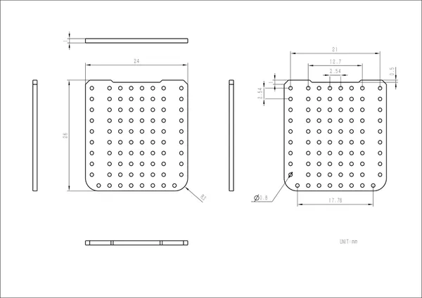

# Capsule Proto

**M5Stack** · Source collection

Revision: Unverified source identity  
Coverage: Source collection; review pending

[Browse all manufacturers](../../../../BROWSE.md) · [Devices & IoT](../../../../DEVICES.md) · [Open in the browser guide](https://valleytech-black-wire-guide.pages.dev/?board=source-board-42bedf822aedda5aac)

Device category: **Wearables**

## Dimensions

**source reference** · Unreviewed source · JPG

[Open original reference](../../../../library/media/be9b9b11008e613c9b1ad6e2eba5248d0e44fc68e51c9ad64fc3fc783d22c806.jpg)

**Credit and rights:** Source rights not yet established. Source/manufacturer: M5Stack.

[Source 1](https://static-cdn.m5stack.com/resource/docs/products/accessory/Capsule-proto/img-6b60e6bb-b5d5-414e-9ec1-ef6751648a01.jpg) · [Source 2](https://docs.m5stack.com/en/accessory/Capsule-proto)

Original source index: Dimensions. This file is searchable but has not been promoted to a reviewed physical board pinout.

Image revision: Not identified

SHA-256: `be9b9b11008e613c9b1ad6e2eba5248d0e44fc68e51c9ad64fc3fc783d22c806`

Pin assignments have not been independently electrically verified. Check board revision before wiring.
