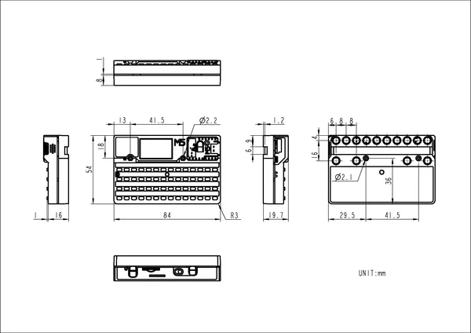

# Cardputer

**M5Stack** · Source collection

Revision: Unverified source identity  
Coverage: Source collection; review pending

[Browse all manufacturers](../../../../BROWSE.md) · [Devices & IoT](../../../../DEVICES.md) · [Open in the browser guide](https://valleytech-black-wire-guide.pages.dev/?board=source-board-b1a05b454e3b933e4e)

Device category: **Handhelds & pocket tools**

## Dimensions

**source reference** · Unreviewed source · PNG

[Open original reference](../../../../library/media/b73ebd73579db9322954609ec6b9db64dc2f8430a5ee6c8583a2c7c6e4894622.png)

**Credit and rights:** Source rights not yet established. Source/manufacturer: M5Stack.

[Source 1](https://static-cdn.m5stack.com/resource/docs/products/core/Cardputer/img-401ac270-d997-4164-ae79-d28be7a3dfaf.png) · [Source 2](https://docs.m5stack.com/en/core/Cardputer)

Original source index: Dimensions. This file is searchable but has not been promoted to a reviewed physical board pinout.

Image revision: Not identified

SHA-256: `b73ebd73579db9322954609ec6b9db64dc2f8430a5ee6c8583a2c7c6e4894622`

Pin assignments have not been independently electrically verified. Check board revision before wiring.
