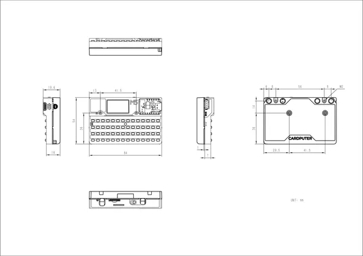

# Cardputer Mesh Kit

**M5Stack** · Source collection

Revision: Unverified source identity  
Coverage: Source collection; review pending

[Browse all manufacturers](../../../../BROWSE.md) · [Desktop app](https://github.com/valleytechsolutions/black-wire-desktop)

## Dimensions

**source reference** · Unreviewed source · PNG

[Open original reference](../../../../library/media/0538542459779f6171cac09068e44c663c2a734976024731f275bd5b06b52d1d.png)

**Credit and rights:** Source rights not yet established. Source/manufacturer: M5Stack.

[Source 1](https://m5stack-doc.oss-cn-shenzhen.aliyuncs.com/1178/K132-Adv-cardputer-ADV_page_01.png) · [Source 2](https://docs.m5stack.com/en/core/Cardputer_Mesh_Kit)

Original source index: Dimensions. This file is searchable but has not been promoted to a reviewed physical board pinout.

SHA-256: `0538542459779f6171cac09068e44c663c2a734976024731f275bd5b06b52d1d`

Pin assignments have not been independently electrically verified. Check board revision before wiring.
