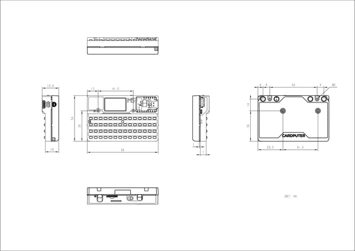
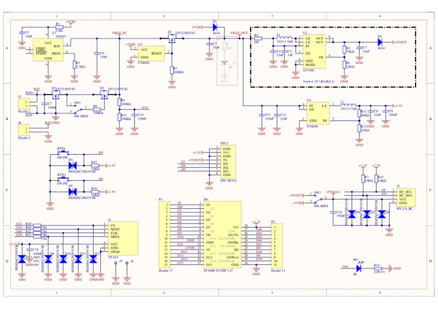
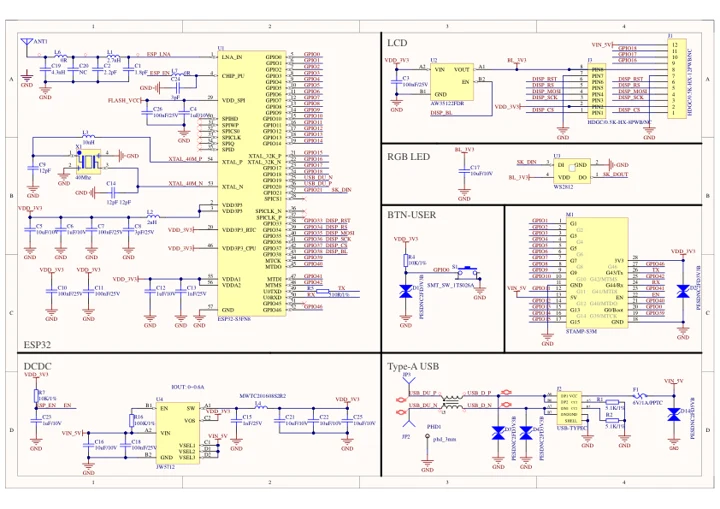
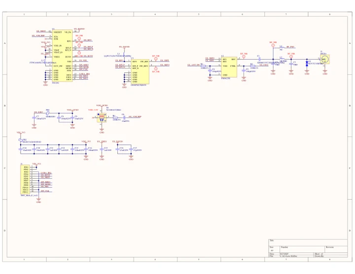

# Cardputer Mesh Kit

**M5Stack** · Source collection

Revision: Unverified source identity

Coverage: Manufacturer references reviewed by scope; independent electrical and all-connector review pending

[Browse all manufacturers](../../../../BROWSE.md) · [Devices & IoT](../../../../DEVICES.md) · [Open in the browser guide](https://valleytech-black-wire-guide.pages.dev/?board=source-board-d77e014d519192bc08)

Device category: **Handhelds & pocket tools**

## Datasheets and original documentation

Board datasheet: **not yet recorded**. Visual reference: **available**.

[Manufacturer hardware documentation](https://docs.m5stack.com/en/core/Cardputer_Mesh_Kit)

- **schematic / recorded-source**: [Cardputer-Adv Schematics PDF](https://m5stack-doc.oss-cn-shenzhen.aliyuncs.com/1178/Sch_M5CardputerAdv_v1.0_2025_06_20_17_19_58.pdf) · [saved document](../../../../library/media/9553f5ee22b6e5f29a385388192e42c5ff76f16281b6f7ea9418f7b62a2d48b0.pdf)
- **schematic / recorded-source**: [Stamp-S3A Schematics PDF](https://m5stack-doc.oss-cn-shenzhen.aliyuncs.com/1150/Sch_StampS3_v0.3.3.pdf) · [saved document](../../../../library/media/2f9610aecc5a5d2ee51b33c75df31cf90c7639d2997e7a2bb147ba8d46b46966.pdf)
- **schematic / recorded-source**: [Stamp LoRa-1262 Mini Schematics PDF](https://m5stack-doc.oss-cn-shenzhen.aliyuncs.com/1208/NEW-1262-SCH_A1-Lora_2025_08_27_10_58_52.pdf) · [saved document](../../../../library/media/6ec29a9240fc8dc41fbe699e74a9f645b9753d7932efc1de28b049fe58e8f03b.pdf)
- **hardware-guide / board**: [Manufacturer pin and hardware documentation](https://docs.m5stack.com/en/core/Cardputer_Mesh_Kit) · online

A chip datasheet, schematic and board datasheet have different scopes. Match the exact hardware revision.

[Documentation coverage and remaining gaps](../../../../DOCUMENTATION.md)

## Dimensions

**source reference** · Unreviewed source · PNG

[Open original reference](../../../../library/media/0538542459779f6171cac09068e44c663c2a734976024731f275bd5b06b52d1d.png)

**Credit and rights:** Source rights not yet established. Source/manufacturer: M5Stack.

[Source 1](https://m5stack-doc.oss-cn-shenzhen.aliyuncs.com/1178/K132-Adv-cardputer-ADV_page_01.png) · [Source 2](https://docs.m5stack.com/en/core/Cardputer_Mesh_Kit)

Original source index: Dimensions. This file is searchable but has not been promoted to a reviewed physical board pinout.

Image revision: Not identified

SHA-256: `0538542459779f6171cac09068e44c663c2a734976024731f275bd5b06b52d1d`

## Cardputer-Adv Schematics PDF

**original reference PDF** · Manufacturer source and first-page preview inspected; independent electrical and all-connector completeness review pending. · PDF

[Open original reference](../../../../library/media/9553f5ee22b6e5f29a385388192e42c5ff76f16281b6f7ea9418f7b62a2d48b0.pdf)

**Credit and rights:** Manufacturer artwork; reuse and print rights not established. Inclusion does not relicense the original.. Source/manufacturer: M5Stack.

[Source 1](https://m5stack-doc.oss-cn-shenzhen.aliyuncs.com/1178/Sch_M5CardputerAdv_v1.0_2025_06_20_17_19_58.pdf) · [Source 2](https://docs.m5stack.com/en/core/Cardputer_Mesh_Kit)

Manufacturer source retained unchanged. Manufacturer source and first-page preview inspected; independent electrical and all-connector completeness review pending.

Image revision: As supplied in the original; match exact board revision

SHA-256: `9553f5ee22b6e5f29a385388192e42c5ff76f16281b6f7ea9418f7b62a2d48b0`

## Stamp-S3A Schematics PDF

**original reference PDF** · Source identity and visual scope inspected; PDF review covers first-page preview. Independent electrical and all-connector completeness review pending. · PDF

[Open original reference](../../../../library/media/2f9610aecc5a5d2ee51b33c75df31cf90c7639d2997e7a2bb147ba8d46b46966.pdf)

**Credit and rights:** Manufacturer artwork; reuse and print rights not established. Inclusion does not relicense the original.. Source/manufacturer: M5Stack.

[Source 1](https://m5stack-doc.oss-cn-shenzhen.aliyuncs.com/1150/Sch_StampS3_v0.3.3.pdf) · [Source 2](https://docs.m5stack.com/en/core/Cardputer_Mesh_Kit)

Manufacturer source retained unchanged. Source identity and visual scope inspected; PDF review covers first-page preview. Independent electrical and all-connector completeness review pending.

Image revision: As supplied in the original; match exact board revision

SHA-256: `2f9610aecc5a5d2ee51b33c75df31cf90c7639d2997e7a2bb147ba8d46b46966`

## Stamp LoRa-1262 Mini Schematics PDF

**original reference PDF** · Source identity and visual scope inspected; PDF review covers first-page preview. Independent electrical and all-connector completeness review pending. · PDF

[Open original reference](../../../../library/media/6ec29a9240fc8dc41fbe699e74a9f645b9753d7932efc1de28b049fe58e8f03b.pdf)

**Credit and rights:** Manufacturer artwork; reuse and print rights not established. Inclusion does not relicense the original.. Source/manufacturer: M5Stack.

[Source 1](https://m5stack-doc.oss-cn-shenzhen.aliyuncs.com/1208/NEW-1262-SCH_A1-Lora_2025_08_27_10_58_52.pdf) · [Source 2](https://docs.m5stack.com/en/core/Cardputer_Mesh_Kit)

Manufacturer source retained unchanged. Source identity and visual scope inspected; PDF review covers first-page preview. Independent electrical and all-connector completeness review pending.

Image revision: As supplied in the original; match exact board revision

SHA-256: `6ec29a9240fc8dc41fbe699e74a9f645b9753d7932efc1de28b049fe58e8f03b`

Pin assignments have not been independently electrically verified. Check board revision before wiring.
