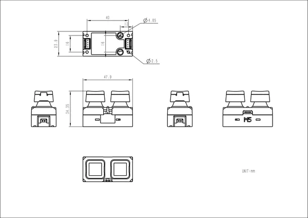

# Chain DualKey

**M5Stack** · Source collection

Revision: Unverified source identity  
Coverage: Source collection; review pending

[Browse all manufacturers](../../../../BROWSE.md) · [Desktop app](https://github.com/valleytechsolutions/black-wire-desktop)

## Dimensions

**source reference** · Unreviewed source · PNG

[Open original reference](../../../../library/media/b359ce282d91065644e5d9a4b94ff946344e7b8711a860d47d3f82143ec047ff.png)

**Credit and rights:** Source rights not yet established. Source/manufacturer: M5Stack.

[Source 1](https://m5stack-doc.oss-cn-shenzhen.aliyuncs.com/1176/C147-chain-dualkey-model-size_page_01.png) · [Source 2](https://docs.m5stack.com/en/chain/Chain_DualKey)

Original source index: Dimensions. This file is searchable but has not been promoted to a reviewed physical board pinout.

SHA-256: `b359ce282d91065644e5d9a4b94ff946344e7b8711a860d47d3f82143ec047ff`

Pin assignments have not been independently electrically verified. Check board revision before wiring.
