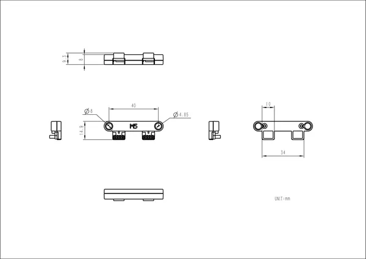

# Chain Return

**M5Stack** · Source collection

Revision: Unverified source identity  
Coverage: Source collection; review pending

[Browse all manufacturers](../../../../BROWSE.md) · [Desktop app](https://github.com/valleytechsolutions/black-wire-desktop)

## Dimensions

**source reference** · Unreviewed source · PNG

[Open original reference](../../../../library/media/1ae4020883a64f6bf31cff987c56c5c188f0b2601bfb1ac3a54dff5848ebb78c.png)

**Credit and rights:** Source rights not yet established. Source/manufacturer: M5Stack.

[Source 1](https://m5stack-doc.oss-cn-shenzhen.aliyuncs.com/1153/Chain_Return_Size.png) · [Source 2](https://docs.m5stack.com/en/accessory/converter/Chain_Return)

Original source index: Dimensions. This file is searchable but has not been promoted to a reviewed physical board pinout.

SHA-256: `1ae4020883a64f6bf31cff987c56c5c188f0b2601bfb1ac3a54dff5848ebb78c`

Pin assignments have not been independently electrically verified. Check board revision before wiring.
