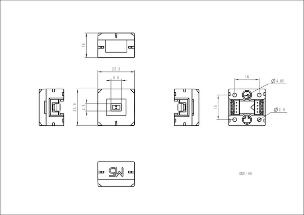
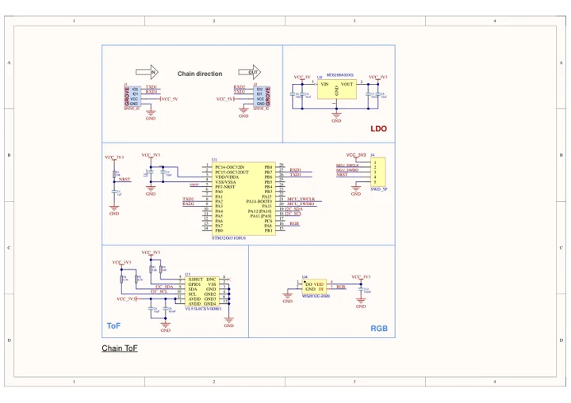

# Chain ToF

**M5Stack** · Source collection

Revision: Unverified source identity

Coverage: Manufacturer references reviewed by scope; independent electrical and all-connector review pending

[Browse all manufacturers](../../../../BROWSE.md) · [Devices & IoT](../../../../DEVICES.md) · [Open in the browser guide](https://valleytech-black-wire-guide.pages.dev/?board=source-board-f7a61346daa4a5d9d1)

## Datasheets and original documentation

Board datasheet: **not yet recorded**. Visual reference: **available**.

[Manufacturer hardware documentation](https://docs.m5stack.com/en/chain/Chain_ToF)

- **schematic / board**: [Chain ToF Schematics PDF](https://m5stack-doc.oss-cn-shenzhen.aliyuncs.com/1199/U209_Chain-ToF_SCH_Main_V1.0_20250515_2025_10_30_22_09_27.pdf) · [saved document](../../../../library/media/8b9ea8f2abdc5d71c17e1ebef425871a9a24835dc60015730ffeaefc80dcd8fc.pdf)
- **hardware-guide / board**: [Manufacturer pin and hardware documentation](https://docs.m5stack.com/en/chain/Chain_ToF) · online

A chip datasheet, schematic and board datasheet have different scopes. Match the exact hardware revision.

[Documentation coverage and remaining gaps](../../../../DOCUMENTATION.md)

## Dimensions

**source reference** · Unreviewed source · PNG

[Open original reference](../../../../library/media/88d755c25bfb0ffcf2244127df950374bdb6d276ea857e74412714bba377d5fa.png)

**Credit and rights:** Source rights not yet established. Source/manufacturer: M5Stack.

[Source 1](https://m5stack-doc.oss-cn-shenzhen.aliyuncs.com/1199/U209-model-size-Chain-ToF_page_01.png) · [Source 2](https://docs.m5stack.com/en/chain/Chain_ToF)

Original source index: Dimensions. This file is searchable but has not been promoted to a reviewed physical board pinout.

Image revision: Not identified

SHA-256: `88d755c25bfb0ffcf2244127df950374bdb6d276ea857e74412714bba377d5fa`

## Chain ToF Schematics PDF

**original reference PDF** · Manufacturer source and first-page preview inspected; independent electrical and all-connector completeness review pending. · PDF

[Open original reference](../../../../library/media/8b9ea8f2abdc5d71c17e1ebef425871a9a24835dc60015730ffeaefc80dcd8fc.pdf)

**Credit and rights:** Manufacturer artwork; reuse and print rights not established. Inclusion does not relicense the original.. Source/manufacturer: M5Stack.

[Source 1](https://m5stack-doc.oss-cn-shenzhen.aliyuncs.com/1199/U209_Chain-ToF_SCH_Main_V1.0_20250515_2025_10_30_22_09_27.pdf) · [Source 2](https://docs.m5stack.com/en/chain/Chain_ToF)

Manufacturer source retained unchanged. Manufacturer source and first-page preview inspected; independent electrical and all-connector completeness review pending.

Image revision: As supplied in the original; match exact board revision

SHA-256: `8b9ea8f2abdc5d71c17e1ebef425871a9a24835dc60015730ffeaefc80dcd8fc`

Pin assignments have not been independently electrically verified. Check board revision before wiring.
