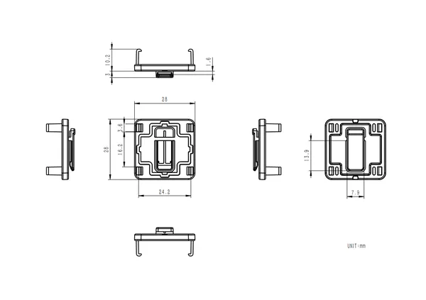
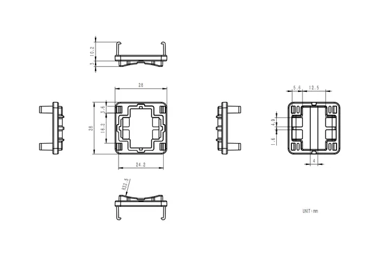
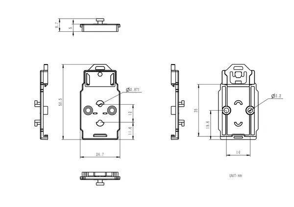
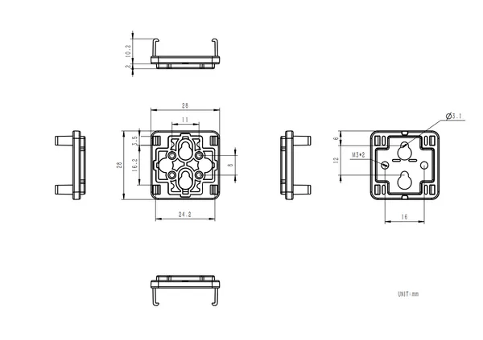

# CLIP-A

**M5Stack** · Source collection

Revision: Unverified source identity  
Coverage: Source collection; review pending

[Browse all manufacturers](../../../../BROWSE.md) · [Desktop app](https://github.com/valleytechsolutions/black-wire-desktop)

## Dimensions

**source reference** · Unreviewed source · PNG

[Open original reference](../../../../library/media/bc137a766a1af04c54c96cfa695456a0877c59355be1ec53c97084087875c5c2.png)

**Credit and rights:** Source rights not yet established. Source/manufacturer: M5Stack.

[Source 1](https://m5stack.oss-cn-shenzhen.aliyuncs.com/resource/docs/products/accessory/CLIP-A/Module%20Size2.png) · [Source 2](https://docs.m5stack.com/en/accessory/CLIP-A)

Original source index: Dimensions. This file is searchable but has not been promoted to a reviewed physical board pinout.

SHA-256: `bc137a766a1af04c54c96cfa695456a0877c59355be1ec53c97084087875c5c2`

## Dimensions

**source reference** · Unreviewed source · PNG

[Open original reference](../../../../library/media/2049c5da38b1478ad765784bfb9cd09abdc9ea618ae92746b2870607fda7fef7.png)

**Credit and rights:** Source rights not yet established. Source/manufacturer: M5Stack.

[Source 1](https://m5stack.oss-cn-shenzhen.aliyuncs.com/resource/docs/products/accessory/CLIP-A/Module%20Size3.png) · [Source 2](https://docs.m5stack.com/en/accessory/CLIP-A)

Original source index: Dimensions. This file is searchable but has not been promoted to a reviewed physical board pinout.

SHA-256: `2049c5da38b1478ad765784bfb9cd09abdc9ea618ae92746b2870607fda7fef7`

## Dimensions

**source reference** · Unreviewed source · PNG

[Open original reference](../../../../library/media/e1fc7af8423eb01703b49bf9622d8110d7a9a78e64e8908dbefaaa4ef2722bde.png)

**Credit and rights:** Source rights not yet established. Source/manufacturer: M5Stack.

[Source 1](https://m5stack.oss-cn-shenzhen.aliyuncs.com/resource/docs/products/accessory/CLIP-A/Module%20Size7.png) · [Source 2](https://docs.m5stack.com/en/accessory/CLIP-A)

Original source index: Dimensions. This file is searchable but has not been promoted to a reviewed physical board pinout.

SHA-256: `e1fc7af8423eb01703b49bf9622d8110d7a9a78e64e8908dbefaaa4ef2722bde`

## Dimensions

**source reference** · Unreviewed source · PNG

[Open original reference](../../../../library/media/ffbbe460370c47a23627c0745d2fb1748f812b6ed54bf65ddd510a50b4e57e2b.png)

**Credit and rights:** Source rights not yet established. Source/manufacturer: M5Stack.

[Source 1](https://m5stack.oss-cn-shenzhen.aliyuncs.com/resource/docs/products/accessory/CLIP-A/Module%20Size1.png) · [Source 2](https://docs.m5stack.com/en/accessory/CLIP-A)

Original source index: Dimensions. This file is searchable but has not been promoted to a reviewed physical board pinout.

SHA-256: `ffbbe460370c47a23627c0745d2fb1748f812b6ed54bf65ddd510a50b4e57e2b`

Pin assignments have not been independently electrically verified. Check board revision before wiring.
