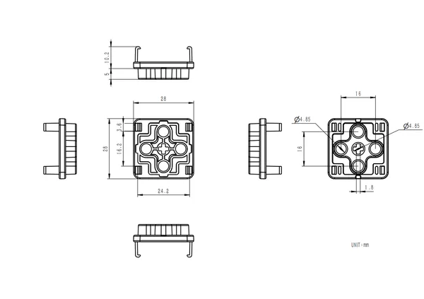
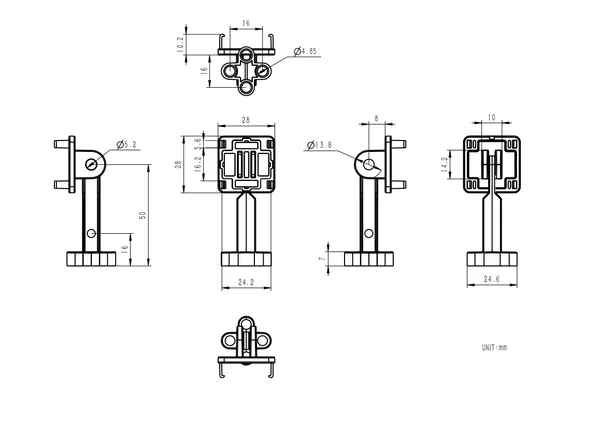
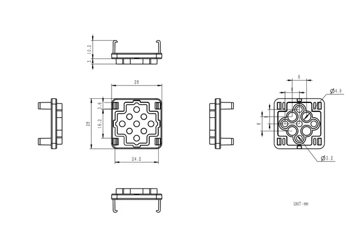

# CLIP-B

**M5Stack** · Source collection

Revision: Unverified source identity  
Coverage: Source collection; review pending

[Browse all manufacturers](../../../../BROWSE.md) · [Desktop app](https://github.com/valleytechsolutions/black-wire-desktop)

## Dimensions

**source reference** · Unreviewed source · PNG

[Open original reference](../../../../library/media/7fae96013c1e7c1c54186867547e8cfaa0f5d8723e4531da1823015fec795747.png)

**Credit and rights:** Source rights not yet established. Source/manufacturer: M5Stack.

[Source 1](https://m5stack.oss-cn-shenzhen.aliyuncs.com/resource/docs/products/accessory/CLIP-B/Module%20Size5.png) · [Source 2](https://docs.m5stack.com/en/accessory/CLIP-B)

Original source index: Dimensions. This file is searchable but has not been promoted to a reviewed physical board pinout.

SHA-256: `7fae96013c1e7c1c54186867547e8cfaa0f5d8723e4531da1823015fec795747`

## Dimensions

**source reference** · Unreviewed source · PNG

[Open original reference](../../../../library/media/c96f313dccb045662a5bcd80d2e71fbb2cc4d967c54fe8c300cdb5db83bc9792.png)

**Credit and rights:** Source rights not yet established. Source/manufacturer: M5Stack.

[Source 1](https://m5stack.oss-cn-shenzhen.aliyuncs.com/resource/docs/products/accessory/CLIP-B/Module%20Size6.png) · [Source 2](https://docs.m5stack.com/en/accessory/CLIP-B)

Original source index: Dimensions. This file is searchable but has not been promoted to a reviewed physical board pinout.

SHA-256: `c96f313dccb045662a5bcd80d2e71fbb2cc4d967c54fe8c300cdb5db83bc9792`

## Dimensions

**source reference** · Unreviewed source · PNG

[Open original reference](../../../../library/media/3c37a1474b6dc3ec1d4bb515d5706002f788837a8ce4bdadfd93742a57f1aeb0.png)

**Credit and rights:** Source rights not yet established. Source/manufacturer: M5Stack.

[Source 1](https://m5stack.oss-cn-shenzhen.aliyuncs.com/resource/docs/products/accessory/CLIP-B/Module%20Size4.png) · [Source 2](https://docs.m5stack.com/en/accessory/CLIP-B)

Original source index: Dimensions. This file is searchable but has not been promoted to a reviewed physical board pinout.

SHA-256: `3c37a1474b6dc3ec1d4bb515d5706002f788837a8ce4bdadfd93742a57f1aeb0`

Pin assignments have not been independently electrically verified. Check board revision before wiring.
