# Connector

**M5Stack** · Source collection

Revision: Unverified source identity  
Coverage: Source collection; review pending

[Browse all manufacturers](../../../../BROWSE.md) · [Desktop app](https://github.com/valleytechsolutions/black-wire-desktop)

## Dimensions

**source reference** · Unreviewed source · PNG

[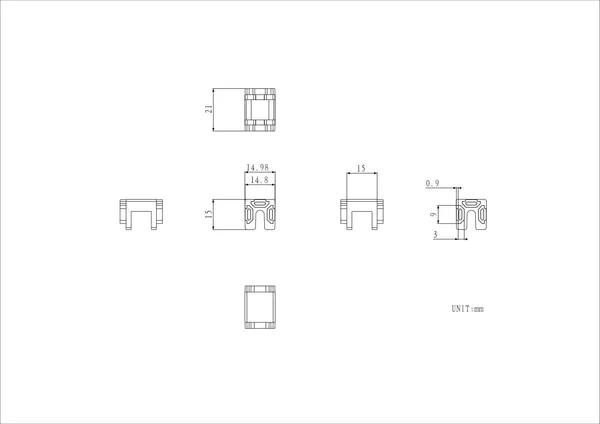](../../../../library/media/d2ec0c00ad29af707a031c4f7fa01f49aafacbee5986d2bb578d6ebb79eab46a.png)

[Open original reference](../../../../library/media/d2ec0c00ad29af707a031c4f7fa01f49aafacbee5986d2bb578d6ebb79eab46a.png)

**Credit and rights:** Source rights not yet established. Source/manufacturer: M5Stack.

[Source 1](https://m5stack-doc.oss-cn-shenzhen.aliyuncs.com/1123/a059Connector_page_01.png) · [Source 2](https://docs.m5stack.com/en/1515/connectors)

Original source index: Dimensions. This file is searchable but has not been promoted to a reviewed physical board pinout.

SHA-256: `d2ec0c00ad29af707a031c4f7fa01f49aafacbee5986d2bb578d6ebb79eab46a`

## Dimensions

**source reference** · Unreviewed source · PNG

[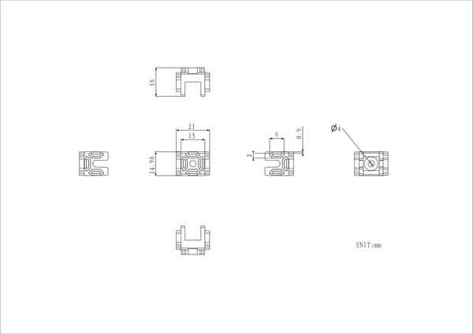](../../../../library/media/794143977e9b7a6f9edb874589a25f8ddc16ebcae30af765309ae9f72bda0f9b.png)

[Open original reference](../../../../library/media/794143977e9b7a6f9edb874589a25f8ddc16ebcae30af765309ae9f72bda0f9b.png)

**Credit and rights:** Source rights not yet established. Source/manufacturer: M5Stack.

[Source 1](https://m5stack-doc.oss-cn-shenzhen.aliyuncs.com/1123/a060Connector_page_01.png) · [Source 2](https://docs.m5stack.com/en/1515/connectors)

Original source index: Dimensions. This file is searchable but has not been promoted to a reviewed physical board pinout.

SHA-256: `794143977e9b7a6f9edb874589a25f8ddc16ebcae30af765309ae9f72bda0f9b`

## Dimensions

**source reference** · Unreviewed source · PNG

[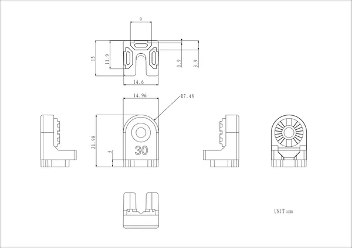](../../../../library/media/526b42e361fac444e72355a334c32de776d54d064e445a206e3fbca75e71719f.png)

[Open original reference](../../../../library/media/526b42e361fac444e72355a334c32de776d54d064e445a206e3fbca75e71719f.png)

**Credit and rights:** Source rights not yet established. Source/manufacturer: M5Stack.

[Source 1](https://m5stack-doc.oss-cn-shenzhen.aliyuncs.com/1123/a053a_page_01.png) · [Source 2](https://docs.m5stack.com/en/1515/connectors)

Original source index: Dimensions. This file is searchable but has not been promoted to a reviewed physical board pinout.

SHA-256: `526b42e361fac444e72355a334c32de776d54d064e445a206e3fbca75e71719f`

## Dimensions

**source reference** · Unreviewed source · PNG

[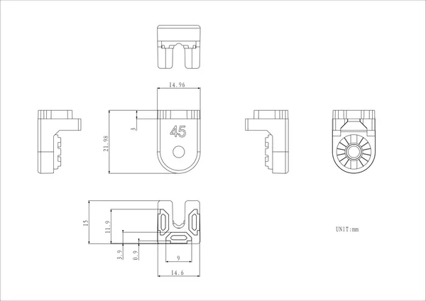](../../../../library/media/b549a43a550311bd525bb7a769c7e862f89b04d9a455dd5faf080877cde3e02f.png)

[Open original reference](../../../../library/media/b549a43a550311bd525bb7a769c7e862f89b04d9a455dd5faf080877cde3e02f.png)

**Credit and rights:** Source rights not yet established. Source/manufacturer: M5Stack.

[Source 1](https://m5stack-doc.oss-cn-shenzhen.aliyuncs.com/1123/a054a_page_01.png) · [Source 2](https://docs.m5stack.com/en/1515/connectors)

Original source index: Dimensions. This file is searchable but has not been promoted to a reviewed physical board pinout.

SHA-256: `b549a43a550311bd525bb7a769c7e862f89b04d9a455dd5faf080877cde3e02f`

## Dimensions

**source reference** · Unreviewed source · PNG

[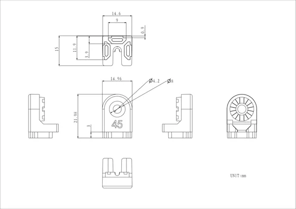](../../../../library/media/d20baa987a0c7c74b21191b2e4c51a18dba983b560b0f0856ead0fd4098c0f52.png)

[Open original reference](../../../../library/media/d20baa987a0c7c74b21191b2e4c51a18dba983b560b0f0856ead0fd4098c0f52.png)

**Credit and rights:** Source rights not yet established. Source/manufacturer: M5Stack.

[Source 1](https://m5stack-doc.oss-cn-shenzhen.aliyuncs.com/1123/a054a_page_02.png) · [Source 2](https://docs.m5stack.com/en/1515/connectors)

Original source index: Dimensions. This file is searchable but has not been promoted to a reviewed physical board pinout.

SHA-256: `d20baa987a0c7c74b21191b2e4c51a18dba983b560b0f0856ead0fd4098c0f52`

## Dimensions

**source reference** · Unreviewed source · PNG

[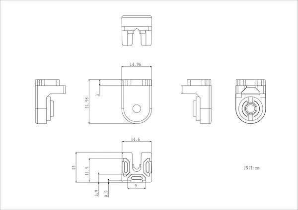](../../../../library/media/5403cc7bc7d26611eab824c66db0dba85d53bf79ee0244590dbd866cb652cbc7.png)

[Open original reference](../../../../library/media/5403cc7bc7d26611eab824c66db0dba85d53bf79ee0244590dbd866cb652cbc7.png)

**Credit and rights:** Source rights not yet established. Source/manufacturer: M5Stack.

[Source 1](https://m5stack-doc.oss-cn-shenzhen.aliyuncs.com/1123/a055anya_page_01.png) · [Source 2](https://docs.m5stack.com/en/1515/connectors)

Original source index: Dimensions. This file is searchable but has not been promoted to a reviewed physical board pinout.

SHA-256: `5403cc7bc7d26611eab824c66db0dba85d53bf79ee0244590dbd866cb652cbc7`

## Dimensions

**source reference** · Unreviewed source · PNG

[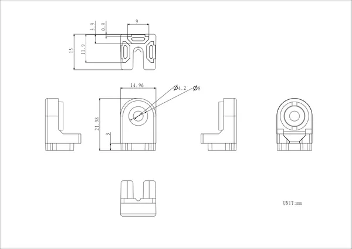](../../../../library/media/5ae5a2579183fd18b39294d0b8125a8d686cee39466c03d58a5337a6bf37d57d.png)

[Open original reference](../../../../library/media/5ae5a2579183fd18b39294d0b8125a8d686cee39466c03d58a5337a6bf37d57d.png)

**Credit and rights:** Source rights not yet established. Source/manufacturer: M5Stack.

[Source 1](https://m5stack-doc.oss-cn-shenzhen.aliyuncs.com/1123/a055anya_page_02.png) · [Source 2](https://docs.m5stack.com/en/1515/connectors)

Original source index: Dimensions. This file is searchable but has not been promoted to a reviewed physical board pinout.

SHA-256: `5ae5a2579183fd18b39294d0b8125a8d686cee39466c03d58a5337a6bf37d57d`

## Dimensions

**source reference** · Unreviewed source · PNG

[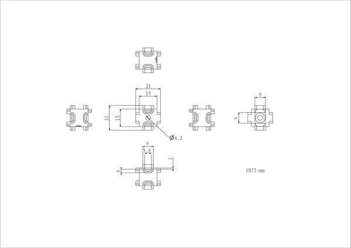](../../../../library/media/b0f6bacf931dd945590b3f2dccffdff11d9b24c134ef34b53af30cf0ed073713.png)

[Open original reference](../../../../library/media/b0f6bacf931dd945590b3f2dccffdff11d9b24c134ef34b53af30cf0ed073713.png)

**Credit and rights:** Source rights not yet established. Source/manufacturer: M5Stack.

[Source 1](https://m5stack-doc.oss-cn-shenzhen.aliyuncs.com/1123/a056Connector_page_01.png) · [Source 2](https://docs.m5stack.com/en/1515/connectors)

Original source index: Dimensions. This file is searchable but has not been promoted to a reviewed physical board pinout.

SHA-256: `b0f6bacf931dd945590b3f2dccffdff11d9b24c134ef34b53af30cf0ed073713`

## Dimensions

**source reference** · Unreviewed source · PNG

[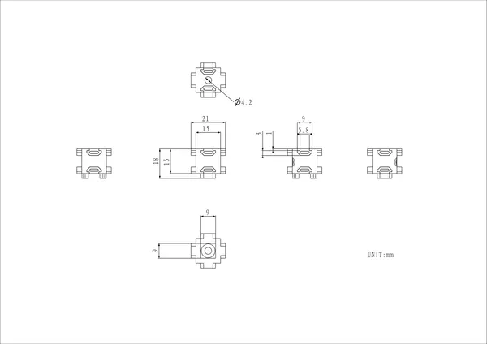](../../../../library/media/51b464d372a0ebfc1d32cb24687e5ed1690d64038b4c55f3750108bd6901a0ef.png)

[Open original reference](../../../../library/media/51b464d372a0ebfc1d32cb24687e5ed1690d64038b4c55f3750108bd6901a0ef.png)

**Credit and rights:** Source rights not yet established. Source/manufacturer: M5Stack.

[Source 1](https://m5stack-doc.oss-cn-shenzhen.aliyuncs.com/1123/a057Connector_page_01.png) · [Source 2](https://docs.m5stack.com/en/1515/connectors)

Original source index: Dimensions. This file is searchable but has not been promoted to a reviewed physical board pinout.

SHA-256: `51b464d372a0ebfc1d32cb24687e5ed1690d64038b4c55f3750108bd6901a0ef`

## Dimensions

**source reference** · Unreviewed source · PNG

[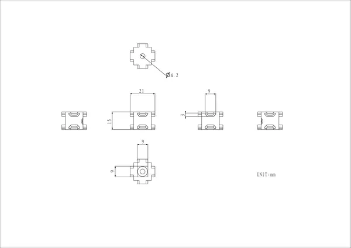](../../../../library/media/d99a75e3c106f64b62c5cf7c56c0dcd8a5fa21d5815f59dad52e3e0d2d087ea0.png)

[Open original reference](../../../../library/media/d99a75e3c106f64b62c5cf7c56c0dcd8a5fa21d5815f59dad52e3e0d2d087ea0.png)

**Credit and rights:** Source rights not yet established. Source/manufacturer: M5Stack.

[Source 1](https://m5stack-doc.oss-cn-shenzhen.aliyuncs.com/1123/a058Connector_page_01.png) · [Source 2](https://docs.m5stack.com/en/1515/connectors)

Original source index: Dimensions. This file is searchable but has not been promoted to a reviewed physical board pinout.

SHA-256: `d99a75e3c106f64b62c5cf7c56c0dcd8a5fa21d5815f59dad52e3e0d2d087ea0`

## Dimensions

**source reference** · Unreviewed source · PNG

[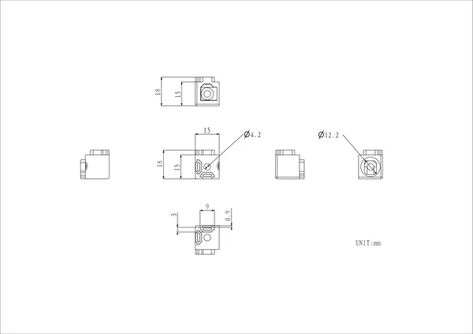](../../../../library/media/7c6570944e87e8e615d298104df8448d1e7bb8bc85d54763a6bbe594ba2c6c4b.png)

[Open original reference](../../../../library/media/7c6570944e87e8e615d298104df8448d1e7bb8bc85d54763a6bbe594ba2c6c4b.png)

**Credit and rights:** Source rights not yet established. Source/manufacturer: M5Stack.

[Source 1](https://m5stack-doc.oss-cn-shenzhen.aliyuncs.com/1123/a052Connector_page_01.png) · [Source 2](https://docs.m5stack.com/en/1515/connectors)

Original source index: Dimensions. This file is searchable but has not been promoted to a reviewed physical board pinout.

SHA-256: `7c6570944e87e8e615d298104df8448d1e7bb8bc85d54763a6bbe594ba2c6c4b`

Pin assignments have not been independently electrically verified. Check board revision before wiring.
