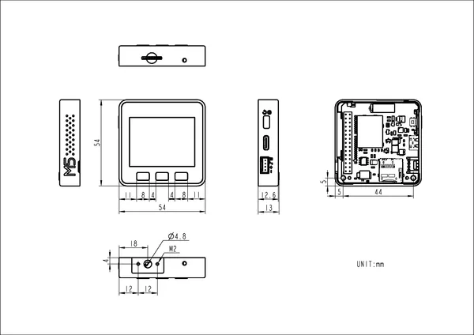

# Core Metal

**M5Stack** · Source collection

Revision: Unverified source identity  
Coverage: Source collection; review pending

[Browse all manufacturers](../../../../BROWSE.md) · [Devices & IoT](../../../../DEVICES.md) · [Open in the browser guide](https://valleytech-black-wire-guide.pages.dev/?board=source-board-7248f9fc326a4d6853)

Device category: **Controllers & instruments**

## Dimensions

**source reference** · Unreviewed source · PNG

[Open original reference](../../../../library/media/a9f605998089945bdb0b87709bfbf08cd2bd6208b338c6620c106f7421c55cc8.png)

**Credit and rights:** Source rights not yet established. Source/manufacturer: M5Stack.

[Source 1](https://static-cdn.m5stack.com/resource/docs/products/core/CORE Metal/img-0b4fe9a8-a7b8-4619-9e2b-a91b163b78d8.png) · [Source 2](https://docs.m5stack.com/en/core/CORE%20Metal)

Original source index: Dimensions. This file is searchable but has not been promoted to a reviewed physical board pinout.

Image revision: Not identified

SHA-256: `a9f605998089945bdb0b87709bfbf08cd2bd6208b338c6620c106f7421c55cc8`

Pin assignments have not been independently electrically verified. Check board revision before wiring.
