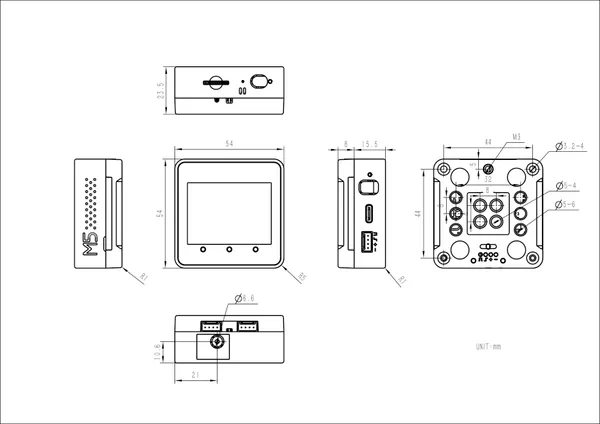

# Core2 For AWS

**M5Stack** · Source collection

Revision: Unverified source identity  
Coverage: Source collection; review pending

[Browse all manufacturers](../../../../BROWSE.md) · [Devices & IoT](../../../../DEVICES.md) · [Open in the browser guide](https://valleytech-black-wire-guide.pages.dev/?board=source-board-d43cf2169f45b52c21)

Device category: **Controllers & instruments**

## Dimensions

**source reference** · Unreviewed source · JPG

[Open original reference](../../../../library/media/761a5753d07e9c691340e5588a52e287caf74ef2e134877b9079fcf674c696f2.jpg)

**Credit and rights:** Source rights not yet established. Source/manufacturer: M5Stack.

[Source 1](https://m5stack.oss-cn-shenzhen.aliyuncs.com/resource/docs/products/core/core2_for_aws/img-dea808fa-615c-41c0-9d1c-b1c4d56f3900.jpg) · [Source 2](https://docs.m5stack.com/en/core/core2_for_aws)

Original source index: Dimensions. This file is searchable but has not been promoted to a reviewed physical board pinout.

Image revision: Not identified

SHA-256: `761a5753d07e9c691340e5588a52e287caf74ef2e134877b9079fcf674c696f2`

Pin assignments have not been independently electrically verified. Check board revision before wiring.
