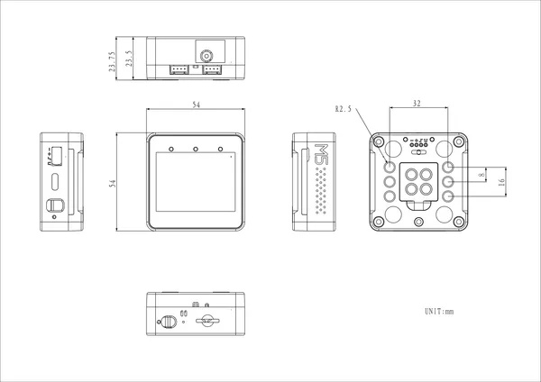

# Core2 For AWS v1.3

**M5Stack** · Source collection

Revision: Unverified source identity  
Coverage: Source collection; review pending

[Browse all manufacturers](../../../../BROWSE.md) · [Devices & IoT](../../../../DEVICES.md) · [Open in the browser guide](https://valleytech-black-wire-guide.pages.dev/?board=source-board-e26c1d94097665811a)

Device category: **Controllers & instruments**

## Dimensions

**source reference** · Unreviewed source · PNG

[Open original reference](../../../../library/media/7bd42301cdd368ea1b0020201a84bd2bcdeeb9ac55e9d4913cbb6d1f79208ff2.png)

**Credit and rights:** Source rights not yet established. Source/manufacturer: M5Stack.

[Source 1](https://m5stack-doc.oss-cn-shenzhen.aliyuncs.com/1226/K010-AWS-V13_Core2_For_AWS_v1.3_Dimension_Diagram_page_01.png) · [Source 2](https://docs.m5stack.com/en/core/Core2_For_AWS_v1.3)

Original source index: Dimensions. This file is searchable but has not been promoted to a reviewed physical board pinout.

Image revision: Not identified

SHA-256: `7bd42301cdd368ea1b0020201a84bd2bcdeeb9ac55e9d4913cbb6d1f79208ff2`

Pin assignments have not been independently electrically verified. Check board revision before wiring.
