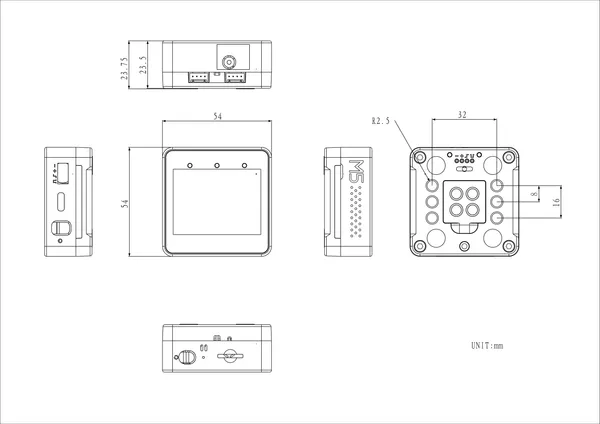
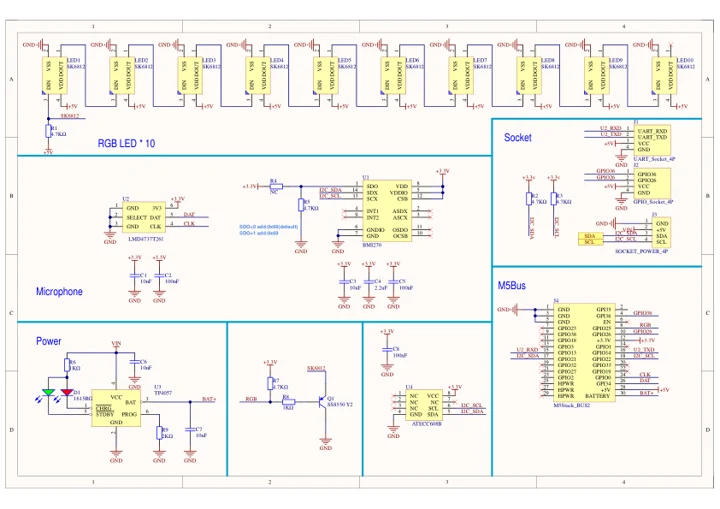

# Core2 For AWS v1.3

**M5Stack** · Source collection

Revision: Unverified source identity

Coverage: Manufacturer references reviewed by scope; independent electrical and all-connector review pending

[Browse all manufacturers](../../../../BROWSE.md) · [Devices & IoT](../../../../DEVICES.md) · [Open in the browser guide](https://valleytech-black-wire-guide.pages.dev/?board=source-board-e26c1d94097665811a)

Device category: **Controllers & instruments**

## Datasheets and original documentation

Board datasheet: **not yet recorded**. Visual reference: **available**.

[Manufacturer hardware documentation](https://docs.m5stack.com/en/core/Core2_For_AWS_v1.3)

- **schematic / recorded-source**: [Core2 Schematics PDF](https://m5stack-doc.oss-cn-shenzhen.aliyuncs.com/644/CORE2_V1.0_SCH.pdf) · [saved document](../../../../library/media/4a59d16291c7de9d9deda31fe154c8b5ac3c8f92209f6f8206d72f97afeea94f.pdf)
- **schematic / recorded-source**: [M5GO-Bottom For AWS v1.3 Schematics PDF](https://m5stack-doc.oss-cn-shenzhen.aliyuncs.com/1226/SCH_M5GO_Bottom2_SCH_Main_V1.3_AWS_Version_2026_01_30_10_06_42.pdf) · [saved document](../../../../library/media/10e007d004efaa888ee524af118f184d6eab7b1b8faef53bd2847cacfc6766ef.pdf)
- **hardware-guide / board**: [Manufacturer pin and hardware documentation](https://docs.m5stack.com/en/core/Core2_For_AWS_v1.3) · online

A chip datasheet, schematic and board datasheet have different scopes. Match the exact hardware revision.

[Documentation coverage and remaining gaps](../../../../DOCUMENTATION.md)

## Dimensions

**source reference** · Unreviewed source · PNG

[Open original reference](../../../../library/media/7bd42301cdd368ea1b0020201a84bd2bcdeeb9ac55e9d4913cbb6d1f79208ff2.png)

**Credit and rights:** Source rights not yet established. Source/manufacturer: M5Stack.

[Source 1](https://m5stack-doc.oss-cn-shenzhen.aliyuncs.com/1226/K010-AWS-V13_Core2_For_AWS_v1.3_Dimension_Diagram_page_01.png) · [Source 2](https://docs.m5stack.com/en/core/Core2_For_AWS_v1.3)

Original source index: Dimensions. This file is searchable but has not been promoted to a reviewed physical board pinout.

Image revision: Not identified

SHA-256: `7bd42301cdd368ea1b0020201a84bd2bcdeeb9ac55e9d4913cbb6d1f79208ff2`

## Core2 Schematics PDF

**original reference PDF** · Manufacturer source and first-page preview inspected; electrical correctness and all-connector completeness not independently approved. · PDF

[Open original reference](../../../../library/media/4a59d16291c7de9d9deda31fe154c8b5ac3c8f92209f6f8206d72f97afeea94f.pdf)

**Credit and rights:** Manufacturer artwork; reuse and print rights not established. Inclusion does not relicense the original.. Source/manufacturer: M5Stack.

[Source 1](https://m5stack-doc.oss-cn-shenzhen.aliyuncs.com/644/CORE2_V1.0_SCH.pdf) · [Source 2](https://docs.m5stack.com/en/core/Core2_For_AWS_v1.3)

Manufacturer source retained unchanged. Manufacturer source and first-page preview inspected; electrical correctness and all-connector completeness not independently approved.

Image revision: As supplied in the original; match exact board revision

SHA-256: `4a59d16291c7de9d9deda31fe154c8b5ac3c8f92209f6f8206d72f97afeea94f`

## M5GO-Bottom For AWS v1.3 Schematics PDF

**original reference PDF** · Manufacturer source and first-page preview inspected; independent electrical and all-connector completeness review pending. · PDF

[Open original reference](../../../../library/media/10e007d004efaa888ee524af118f184d6eab7b1b8faef53bd2847cacfc6766ef.pdf)

**Credit and rights:** Manufacturer artwork; reuse and print rights not established. Inclusion does not relicense the original.. Source/manufacturer: M5Stack.

[Source 1](https://m5stack-doc.oss-cn-shenzhen.aliyuncs.com/1226/SCH_M5GO_Bottom2_SCH_Main_V1.3_AWS_Version_2026_01_30_10_06_42.pdf) · [Source 2](https://docs.m5stack.com/en/core/Core2_For_AWS_v1.3)

Manufacturer source retained unchanged. Manufacturer source and first-page preview inspected; independent electrical and all-connector completeness review pending.

Image revision: As supplied in the original; match exact board revision

SHA-256: `10e007d004efaa888ee524af118f184d6eab7b1b8faef53bd2847cacfc6766ef`

Pin assignments have not been independently electrically verified. Check board revision before wiring.
