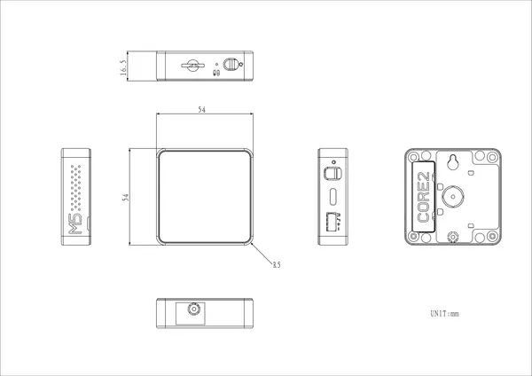
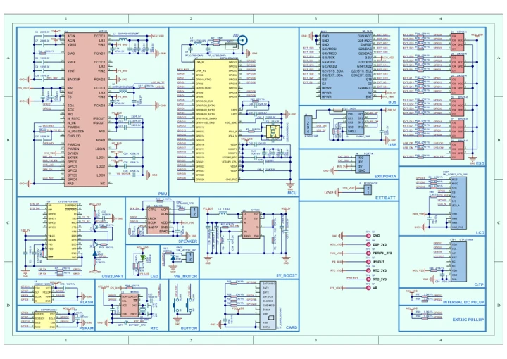
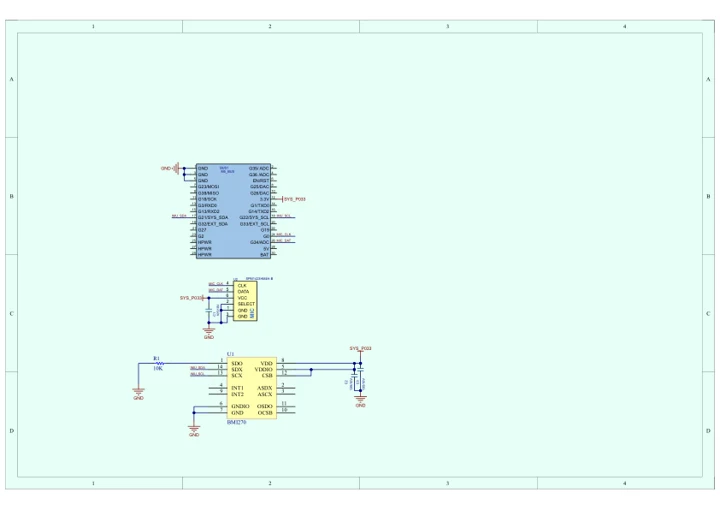

# Core2 v1.3

**M5Stack** · Source collection

Revision: Unverified source identity

Coverage: Manufacturer references reviewed by scope; independent electrical and all-connector review pending

[Browse all manufacturers](../../../../BROWSE.md) · [Devices & IoT](../../../../DEVICES.md) · [Open in the browser guide](https://valleytech-black-wire-guide.pages.dev/?board=source-board-4bb8e8491bfda69bc4)

Device category: **Controllers & instruments**

## Datasheets and original documentation

Board datasheet: **not yet recorded**. Visual reference: **available**.

[Manufacturer hardware documentation](https://docs.m5stack.com/en/core/Core2_v1.3)

- **schematic / board**: [Core2 v1.3 Core Section Schematics PDF](https://m5stack-doc.oss-cn-shenzhen.aliyuncs.com/644/CORE2_V1.0_SCH.pdf) · [saved document](../../../../library/media/4a59d16291c7de9d9deda31fe154c8b5ac3c8f92209f6f8206d72f97afeea94f.pdf)
- **schematic / board**: [Core2 v1.3 Expansion Board Section Schematics PDF](https://m5stack-doc.oss-cn-shenzhen.aliyuncs.com/486/core2_v1.3_SCH_2025_11_14_09_40_33.pdf) · [saved document](../../../../library/media/7b5def96336139b8ff3b91871ffa476c9b8cd845725263db82e4a8ad8881cea9.pdf)
- **hardware-guide / board**: [Manufacturer pin and hardware documentation](https://docs.m5stack.com/en/core/Core2_v1.3) · online

A chip datasheet, schematic and board datasheet have different scopes. Match the exact hardware revision.

[Documentation coverage and remaining gaps](../../../../DOCUMENTATION.md)

## Dimensions

**source reference** · Unreviewed source · PNG

[Open original reference](../../../../library/media/9b3f628dae16a7e08720c8cf66a70f2dabc3bf93162f0a86c0e8716f16ebb670.png)

**Credit and rights:** Source rights not yet established. Source/manufacturer: M5Stack.

[Source 1](https://m5stack-doc.oss-cn-shenzhen.aliyuncs.com/1231/K010-V13_Core2_v1.3_model-size_page_01.png) · [Source 2](https://docs.m5stack.com/en/core/Core2_v1.3)

Original source index: Dimensions. This file is searchable but has not been promoted to a reviewed physical board pinout.

Image revision: Not identified

SHA-256: `9b3f628dae16a7e08720c8cf66a70f2dabc3bf93162f0a86c0e8716f16ebb670`

## Core2 v1.3 Core Section Schematics PDF

**original reference PDF** · Manufacturer source and first-page preview inspected; electrical correctness and all-connector completeness not independently approved. · PDF

[Open original reference](../../../../library/media/4a59d16291c7de9d9deda31fe154c8b5ac3c8f92209f6f8206d72f97afeea94f.pdf)

**Credit and rights:** Manufacturer artwork; reuse and print rights not established. Inclusion does not relicense the original.. Source/manufacturer: M5Stack.

[Source 1](https://m5stack-doc.oss-cn-shenzhen.aliyuncs.com/644/CORE2_V1.0_SCH.pdf) · [Source 2](https://docs.m5stack.com/en/core/Core2_v1.3)

Manufacturer source retained unchanged. Manufacturer source and first-page preview inspected; electrical correctness and all-connector completeness not independently approved.

Image revision: As supplied in the original; match exact board revision

SHA-256: `4a59d16291c7de9d9deda31fe154c8b5ac3c8f92209f6f8206d72f97afeea94f`

## Core2 v1.3 Expansion Board Section Schematics PDF

**original reference PDF** · Manufacturer source and first-page preview inspected; independent electrical and all-connector completeness review pending. · PDF

[Open original reference](../../../../library/media/7b5def96336139b8ff3b91871ffa476c9b8cd845725263db82e4a8ad8881cea9.pdf)

**Credit and rights:** Manufacturer artwork; reuse and print rights not established. Inclusion does not relicense the original.. Source/manufacturer: M5Stack.

[Source 1](https://m5stack-doc.oss-cn-shenzhen.aliyuncs.com/486/core2_v1.3_SCH_2025_11_14_09_40_33.pdf) · [Source 2](https://docs.m5stack.com/en/core/Core2_v1.3)

Manufacturer source retained unchanged. Manufacturer source and first-page preview inspected; independent electrical and all-connector completeness review pending.

Image revision: As supplied in the original; match exact board revision

SHA-256: `7b5def96336139b8ff3b91871ffa476c9b8cd845725263db82e4a8ad8881cea9`

Pin assignments have not been independently electrically verified. Check board revision before wiring.
