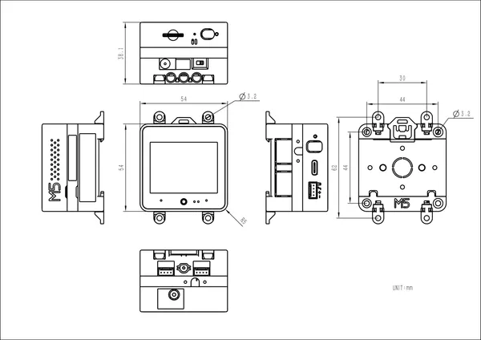

# CoreS3 Thread BR

**M5Stack** · Source collection

Revision: Unverified source identity  
Coverage: Source collection; review pending

[Browse all manufacturers](../../../../BROWSE.md) · [Desktop app](https://github.com/valleytechsolutions/black-wire-desktop)

## Dimensions

**source reference** · Unreviewed source · PNG

[Open original reference](../../../../library/media/c4014ba5c741964e465e7af1759011ba68aaa36c676c10b57f2404acb24142d9.png)

**Credit and rights:** Source rights not yet established. Source/manufacturer: M5Stack.

[Source 1](https://m5stack-doc.oss-cn-shenzhen.aliyuncs.com/1209/K149-CORES3-Thread-BR_page_01.png) · [Source 2](https://docs.m5stack.com/en/core/CoreS3_Thread_BR)

Original source index: Dimensions. This file is searchable but has not been promoted to a reviewed physical board pinout.

SHA-256: `c4014ba5c741964e465e7af1759011ba68aaa36c676c10b57f2404acb24142d9`

Pin assignments have not been independently electrically verified. Check board revision before wiring.
