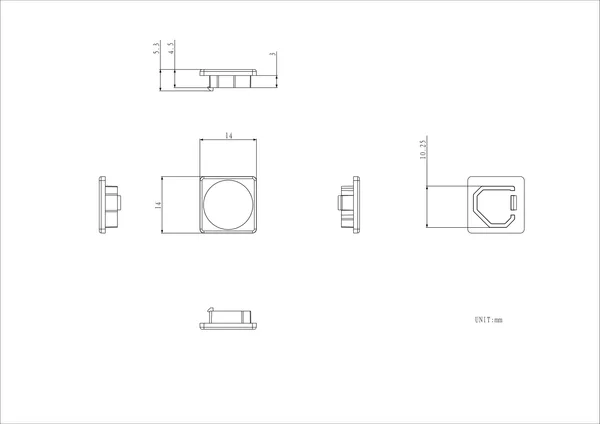
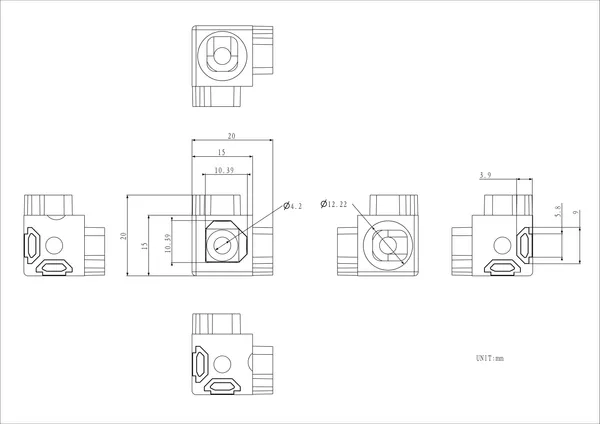

# Corner

**M5Stack** · Source collection

Revision: Unverified source identity  
Coverage: Source collection; review pending

[Browse all manufacturers](../../../../BROWSE.md) · [Desktop app](https://github.com/valleytechsolutions/black-wire-desktop)

## Dimensions

**source reference** · Unreviewed source · PNG

[Open original reference](../../../../library/media/b448fd9509c6947d2b921268bfb203a94f8d90ed5448431fa74fec387f945029.png)

**Credit and rights:** Source rights not yet established. Source/manufacturer: M5Stack.

[Source 1](https://m5stack-doc.oss-cn-shenzhen.aliyuncs.com/1121/A036Corner-cover-model-size_page_01.png) · [Source 2](https://docs.m5stack.com/en/1515/corner)

Original source index: Dimensions. This file is searchable but has not been promoted to a reviewed physical board pinout.

SHA-256: `b448fd9509c6947d2b921268bfb203a94f8d90ed5448431fa74fec387f945029`

## Dimensions

**source reference** · Unreviewed source · PNG

[Open original reference](../../../../library/media/61b2aa24a9cd867b653f5fecdfa612d22cc282f7d1887bb1b96d57668959c826.png)

**Credit and rights:** Source rights not yet established. Source/manufacturer: M5Stack.

[Source 1](https://m5stack-doc.oss-cn-shenzhen.aliyuncs.com/1121/A036Corner-model-size_page_01.png) · [Source 2](https://docs.m5stack.com/en/1515/corner)

Original source index: Dimensions. This file is searchable but has not been promoted to a reviewed physical board pinout.

SHA-256: `61b2aa24a9cd867b653f5fecdfa612d22cc282f7d1887bb1b96d57668959c826`

Pin assignments have not been independently electrically verified. Check board revision before wiring.
