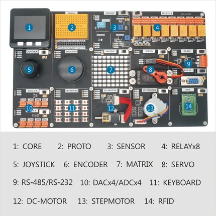

# Demo Board

**M5Stack** · Source collection

Revision: Unverified source identity  
Coverage: Source collection; review pending

[Browse all manufacturers](../../../../BROWSE.md) · [Desktop app](https://github.com/valleytechsolutions/black-wire-desktop)

## Hardware Overview

**source reference** · Unreviewed source · PNG

[Open original reference](../../../../library/media/1feb1658a83f094930ae35c307e5491b32be52fcf03a8a1ef266a07bbb024be1.png)

**Credit and rights:** Source rights not yet established. Source/manufacturer: M5Stack.

[Source 1](https://static-cdn.m5stack.com/resource/docs/products/app/demo-board/demo-board_04.webp) · [Source 2](https://docs.m5stack.com/en/app/demo-board)

Original source index: Hardware Overview. This file is searchable but has not been promoted to a reviewed physical board pinout.

SHA-256: `1feb1658a83f094930ae35c307e5491b32be52fcf03a8a1ef266a07bbb024be1`

Pin assignments have not been independently electrically verified. Check board revision before wiring.
