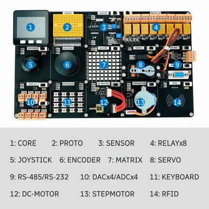

# Demo Board-SHT30

**M5Stack** · Source collection

Revision: Unverified source identity  
Coverage: Source collection; review pending

[Browse all manufacturers](../../../../BROWSE.md) · [Desktop app](https://github.com/valleytechsolutions/black-wire-desktop)

## Hardware Overview

**source reference** · Unreviewed source · PNG

[Open original reference](../../../../library/media/15e0f6acb0d10ae708127f7f1c938775e3a781745545055ba0a3cfa0d27dff1b.png)

**Credit and rights:** Source rights not yet established. Source/manufacturer: M5Stack.

[Source 1](https://static-cdn.m5stack.com/resource/docs/products/app/demo-board_sht30/demo-board_sht30_09.webp) · [Source 2](https://docs.m5stack.com/en/app/demo-board_sht30)

Original source index: Hardware Overview. This file is searchable but has not been promoted to a reviewed physical board pinout.

SHA-256: `15e0f6acb0d10ae708127f7f1c938775e3a781745545055ba0a3cfa0d27dff1b`

Pin assignments have not been independently electrically verified. Check board revision before wiring.
