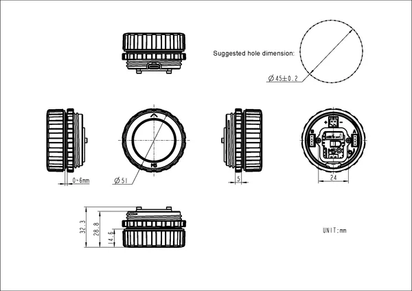

# Dial v1.1

**M5Stack** · Source collection

Revision: Unverified source identity  
Coverage: Source collection; review pending

[Browse all manufacturers](../../../../BROWSE.md) · [Desktop app](https://github.com/valleytechsolutions/black-wire-desktop)

## Dimensions

**source reference** · Unreviewed source · PNG

[Open original reference](../../../../library/media/48cb120283c1f06b557707674d76274614ceee86bb3de0d10fbb2d8b112a53c6.png)

**Credit and rights:** Source rights not yet established. Source/manufacturer: M5Stack.

[Source 1](https://static-cdn.m5stack.com/resource/docs/products/core/M5Dial/img-4739e0cc-227a-4f6b-9956-48915212e9c8.png) · [Source 2](https://docs.m5stack.com/en/core/M5Dial%20V1.1)

Original source index: Dimensions. This file is searchable but has not been promoted to a reviewed physical board pinout.

SHA-256: `48cb120283c1f06b557707674d76274614ceee86bb3de0d10fbb2d8b112a53c6`

Pin assignments have not been independently electrically verified. Check board revision before wiring.
