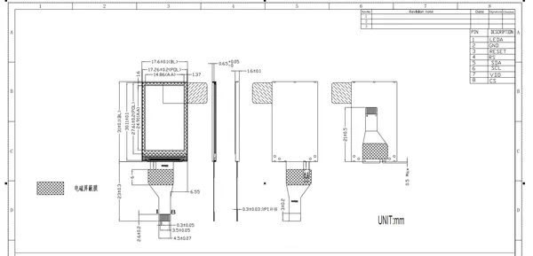

# Display 1.14 Inch

**M5Stack** · Source collection

Revision: Unverified source identity  
Coverage: Source collection; review pending

[Browse all manufacturers](../../../../BROWSE.md) · [Desktop app](https://github.com/valleytechsolutions/black-wire-desktop)

## Dimensions

**source reference** · Unreviewed source · JPG

[Open original reference](../../../../library/media/4c43c00118febe3cc5d4a462426a6bc7fac37f14950bf8a3ed872eff3a36d14d.jpg)

**Credit and rights:** Source rights not yet established. Source/manufacturer: M5Stack.

[Source 1](https://m5stack-doc.oss-cn-shenzhen.aliyuncs.com/1232/A174_model_size.png) · [Source 2](https://docs.m5stack.com/en/accessory/display/Display_1.14_Inch)

Original source index: Dimensions. This file is searchable but has not been promoted to a reviewed physical board pinout.

SHA-256: `4c43c00118febe3cc5d4a462426a6bc7fac37f14950bf8a3ed872eff3a36d14d`

Pin assignments have not been independently electrically verified. Check board revision before wiring.
