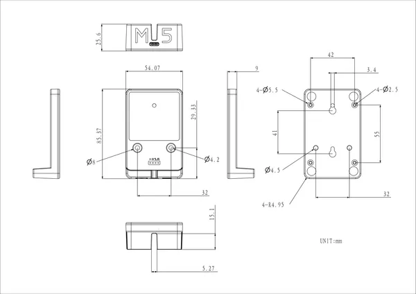
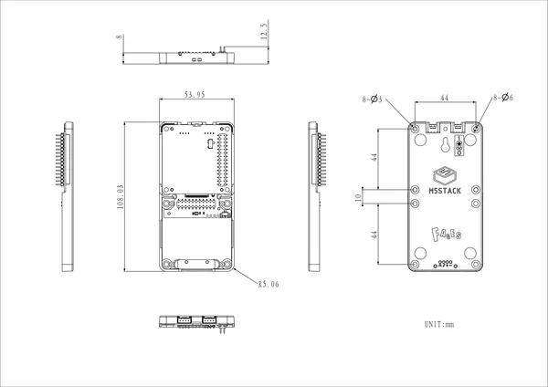

# Faces Bottom3

**M5Stack** · Source collection

Revision: Unverified source identity  
Coverage: Source collection; review pending

[Browse all manufacturers](../../../../BROWSE.md) · [Desktop app](https://github.com/valleytechsolutions/black-wire-desktop)

## Dimensions

**source reference** · Unreviewed source · PNG

[Open original reference](../../../../library/media/21f74e8fca2f16f9cd8bde7d6cde0219aaa3e45a95cb82410c0a95cfda05ad8c.png)

**Credit and rights:** Source rights not yet established. Source/manufacturer: M5Stack.

[Source 1](https://m5stack-doc.oss-cn-shenzhen.aliyuncs.com/1273/A168_Faces_Charging3_model_size_page_01.png) · [Source 2](https://docs.m5stack.com/en/faces/Faces_Bottom3)

Original source index: Dimensions. This file is searchable but has not been promoted to a reviewed physical board pinout.

SHA-256: `21f74e8fca2f16f9cd8bde7d6cde0219aaa3e45a95cb82410c0a95cfda05ad8c`

## Dimensions

**source reference** · Unreviewed source · PNG

[Open original reference](../../../../library/media/98bd10360b00755293f1c34d965ae44acea9dfff64bddd3d203d1a6e155e1e34.png)

**Credit and rights:** Source rights not yet established. Source/manufacturer: M5Stack.

[Source 1](https://m5stack-doc.oss-cn-shenzhen.aliyuncs.com/1273/A168_Faces_Bottom3_model_size_page_01.png) · [Source 2](https://docs.m5stack.com/en/faces/Faces_Bottom3)

Original source index: Dimensions. This file is searchable but has not been promoted to a reviewed physical board pinout.

SHA-256: `98bd10360b00755293f1c34d965ae44acea9dfff64bddd3d203d1a6e155e1e34`

Pin assignments have not been independently electrically verified. Check board revision before wiring.
