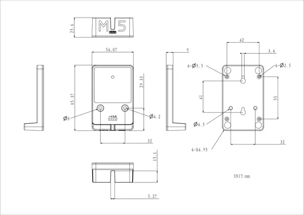
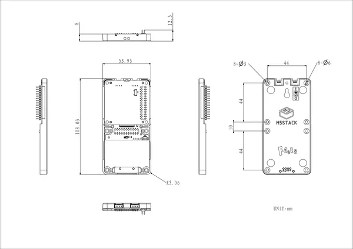
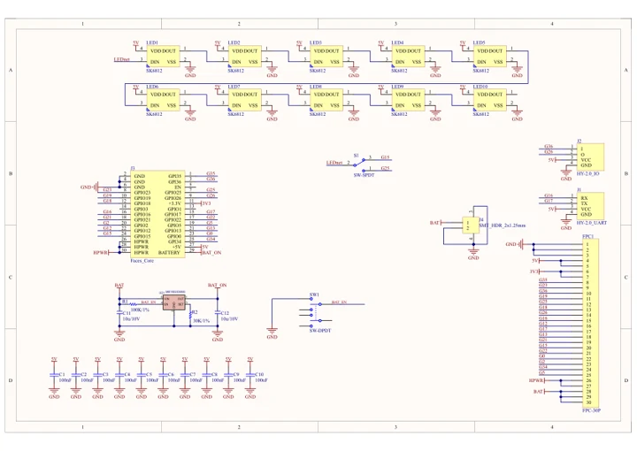

# Faces Bottom3

**M5Stack** · Source collection

Revision: Unverified source identity

Coverage: Manufacturer references reviewed by scope; independent electrical and all-connector review pending

[Browse all manufacturers](../../../../BROWSE.md) · [Devices & IoT](../../../../DEVICES.md) · [Open in the browser guide](https://valleytech-black-wire-guide.pages.dev/?board=source-board-b565ce3b072df52f79)

## Datasheets and original documentation

Board datasheet: **not yet recorded**. Visual reference: **available**.

[Manufacturer hardware documentation](https://docs.m5stack.com/en/faces/Faces_Bottom3)

- **schematic / board**: [Faces Bottom3 Schematics PDF](https://m5stack-doc.oss-cn-shenzhen.aliyuncs.com/1273/A168_Faces_Bottom3_Sche.pdf) · [saved document](../../../../library/media/ced9ea58601b29e25e2f800d38915da57d15457ff22f8ccd167d8c7cb31e5e27.pdf)
- **hardware-guide / board**: [Manufacturer pin and hardware documentation](https://docs.m5stack.com/en/faces/Faces_Bottom3) · online

A chip datasheet, schematic and board datasheet have different scopes. Match the exact hardware revision.

[Documentation coverage and remaining gaps](../../../../DOCUMENTATION.md)

## Dimensions

**source reference** · Unreviewed source · PNG

[Open original reference](../../../../library/media/21f74e8fca2f16f9cd8bde7d6cde0219aaa3e45a95cb82410c0a95cfda05ad8c.png)

**Credit and rights:** Source rights not yet established. Source/manufacturer: M5Stack.

[Source 1](https://m5stack-doc.oss-cn-shenzhen.aliyuncs.com/1273/A168_Faces_Charging3_model_size_page_01.png) · [Source 2](https://docs.m5stack.com/en/faces/Faces_Bottom3)

Original source index: Dimensions. This file is searchable but has not been promoted to a reviewed physical board pinout.

Image revision: Not identified

SHA-256: `21f74e8fca2f16f9cd8bde7d6cde0219aaa3e45a95cb82410c0a95cfda05ad8c`

## Dimensions

**source reference** · Unreviewed source · PNG

[Open original reference](../../../../library/media/98bd10360b00755293f1c34d965ae44acea9dfff64bddd3d203d1a6e155e1e34.png)

**Credit and rights:** Source rights not yet established. Source/manufacturer: M5Stack.

[Source 1](https://m5stack-doc.oss-cn-shenzhen.aliyuncs.com/1273/A168_Faces_Bottom3_model_size_page_01.png) · [Source 2](https://docs.m5stack.com/en/faces/Faces_Bottom3)

Original source index: Dimensions. This file is searchable but has not been promoted to a reviewed physical board pinout.

Image revision: Not identified

SHA-256: `98bd10360b00755293f1c34d965ae44acea9dfff64bddd3d203d1a6e155e1e34`

## Faces Bottom3 Schematics PDF

**original reference PDF** · Manufacturer source and first-page preview inspected; electrical correctness and all-connector completeness not independently approved. · PDF

[Open original reference](../../../../library/media/ced9ea58601b29e25e2f800d38915da57d15457ff22f8ccd167d8c7cb31e5e27.pdf)

**Credit and rights:** Manufacturer artwork; reuse and print rights not established. Inclusion does not relicense the original.. Source/manufacturer: M5Stack.

[Source 1](https://m5stack-doc.oss-cn-shenzhen.aliyuncs.com/1273/A168_Faces_Bottom3_Sche.pdf) · [Source 2](https://docs.m5stack.com/en/faces/Faces_Bottom3)

Manufacturer source retained unchanged. Manufacturer source and first-page preview inspected; electrical correctness and all-connector completeness not independently approved.

Image revision: As supplied in the original; match exact board revision

SHA-256: `ced9ea58601b29e25e2f800d38915da57d15457ff22f8ccd167d8c7cb31e5e27`

Pin assignments have not been independently electrically verified. Check board revision before wiring.
