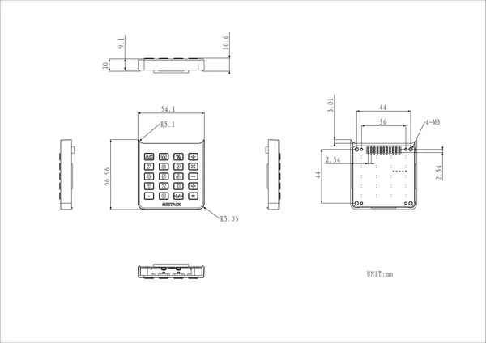
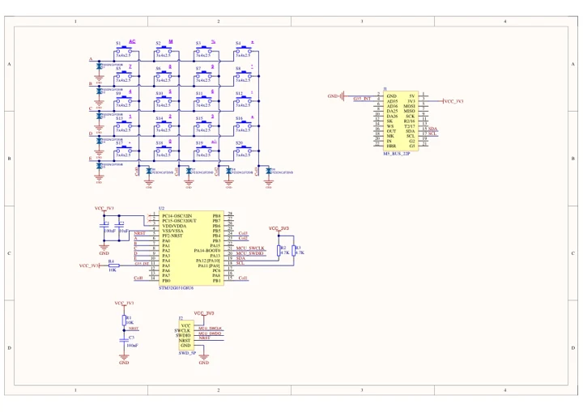

# Faces Calculator3

**M5Stack** · Source collection

Revision: Unverified source identity

Coverage: Manufacturer references reviewed by scope; independent electrical and all-connector review pending

[Browse all manufacturers](../../../../BROWSE.md) · [Devices & IoT](../../../../DEVICES.md) · [Open in the browser guide](https://valleytech-black-wire-guide.pages.dev/?board=source-board-9eefc93576d6d2e68e)

## Datasheets and original documentation

Board datasheet: **not yet recorded**. Visual reference: **available**.

[Manufacturer hardware documentation](https://docs.m5stack.com/en/faces/Faces_Calculator3)

- **schematic / board**: [Faces Calculator3 Schematics PDF](https://m5stack-doc.oss-cn-shenzhen.aliyuncs.com/1272/A005-V3-Faces_Calculator3_Sche.pdf) · [saved document](../../../../library/media/e8d3772d60b7debaa1df40a5fe33fcab6665db3f9ee3933d93e1209d98ee9d0b.pdf)
- **hardware-guide / board**: [Manufacturer pin and hardware documentation](https://docs.m5stack.com/en/faces/Faces_Calculator3) · online

A chip datasheet, schematic and board datasheet have different scopes. Match the exact hardware revision.

[Documentation coverage and remaining gaps](../../../../DOCUMENTATION.md)

## Dimensions

**source reference** · Unreviewed source · PNG

[Open original reference](../../../../library/media/ddd4f5185b030f1ba0a0afe5aab4d0fb9af022053c458588f911abf2f8d61e42.png)

**Credit and rights:** Source rights not yet established. Source/manufacturer: M5Stack.

[Source 1](https://m5stack-doc.oss-cn-shenzhen.aliyuncs.com/1272/A005-V3_Faces_Calculator3_model_size_page_01.png) · [Source 2](https://docs.m5stack.com/en/faces/Faces_Calculator3)

Original source index: Dimensions. This file is searchable but has not been promoted to a reviewed physical board pinout.

Image revision: Not identified

SHA-256: `ddd4f5185b030f1ba0a0afe5aab4d0fb9af022053c458588f911abf2f8d61e42`

## Faces Calculator3 Schematics PDF

**original reference PDF** · Manufacturer source and first-page preview inspected; electrical correctness and all-connector completeness not independently approved. · PDF

[Open original reference](../../../../library/media/e8d3772d60b7debaa1df40a5fe33fcab6665db3f9ee3933d93e1209d98ee9d0b.pdf)

**Credit and rights:** Manufacturer artwork; reuse and print rights not established. Inclusion does not relicense the original.. Source/manufacturer: M5Stack.

[Source 1](https://m5stack-doc.oss-cn-shenzhen.aliyuncs.com/1272/A005-V3-Faces_Calculator3_Sche.pdf) · [Source 2](https://docs.m5stack.com/en/faces/Faces_Calculator3)

Manufacturer source retained unchanged. Manufacturer source and first-page preview inspected; electrical correctness and all-connector completeness not independently approved.

Image revision: As supplied in the original; match exact board revision

SHA-256: `e8d3772d60b7debaa1df40a5fe33fcab6665db3f9ee3933d93e1209d98ee9d0b`

Pin assignments have not been independently electrically verified. Check board revision before wiring.
