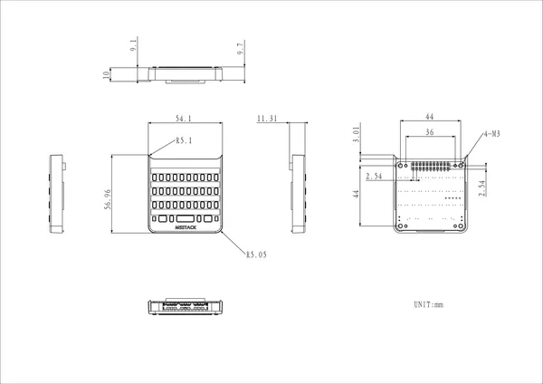
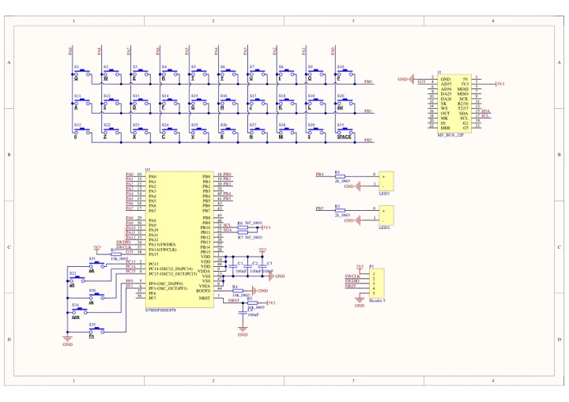

# Faces Keyboard3

**M5Stack** · Source collection

Revision: Unverified source identity

Coverage: Manufacturer references reviewed by scope; independent electrical and all-connector review pending

[Browse all manufacturers](../../../../BROWSE.md) · [Devices & IoT](../../../../DEVICES.md) · [Open in the browser guide](https://valleytech-black-wire-guide.pages.dev/?board=source-board-a390fe2249279e4af6)

## Datasheets and original documentation

Board datasheet: **not yet recorded**. Visual reference: **available**.

[Manufacturer hardware documentation](https://docs.m5stack.com/en/faces/Faces_Keyboard3)

- **schematic / board**: [Faces Keyboard3 Schematics PDF](https://m5stack-doc.oss-cn-shenzhen.aliyuncs.com/1270/A003-V3_Faces_Keyboard3.pdf) · [saved document](../../../../library/media/fd03d7835aebd9ccec14aad0f6d73412ddb2a55b73d20df9d17b12015925ef10.pdf)
- **hardware-guide / board**: [Manufacturer pin and hardware documentation](https://docs.m5stack.com/en/faces/Faces_Keyboard3) · online

A chip datasheet, schematic and board datasheet have different scopes. Match the exact hardware revision.

[Documentation coverage and remaining gaps](../../../../DOCUMENTATION.md)

## Dimensions

**source reference** · Unreviewed source · PNG

[Open original reference](../../../../library/media/b44346ee1bbbad49f7532d73da9f9305b50d53bdef8b60c4a0176c85655f7d9a.png)

**Credit and rights:** Source rights not yet established. Source/manufacturer: M5Stack.

[Source 1](https://m5stack-doc.oss-cn-shenzhen.aliyuncs.com/1270/A003-V3_Faces_Keyboard3_model_size_page_01.png) · [Source 2](https://docs.m5stack.com/en/faces/Faces_Keyboard3)

Original source index: Dimensions. This file is searchable but has not been promoted to a reviewed physical board pinout.

Image revision: Not identified

SHA-256: `b44346ee1bbbad49f7532d73da9f9305b50d53bdef8b60c4a0176c85655f7d9a`

## Faces Keyboard3 Schematics PDF

**original reference PDF** · Manufacturer source and first-page preview inspected; electrical correctness and all-connector completeness not independently approved. · PDF

[Open original reference](../../../../library/media/fd03d7835aebd9ccec14aad0f6d73412ddb2a55b73d20df9d17b12015925ef10.pdf)

**Credit and rights:** Manufacturer artwork; reuse and print rights not established. Inclusion does not relicense the original.. Source/manufacturer: M5Stack.

[Source 1](https://m5stack-doc.oss-cn-shenzhen.aliyuncs.com/1270/A003-V3_Faces_Keyboard3.pdf) · [Source 2](https://docs.m5stack.com/en/faces/Faces_Keyboard3)

Manufacturer source retained unchanged. Manufacturer source and first-page preview inspected; electrical correctness and all-connector completeness not independently approved.

Image revision: As supplied in the original; match exact board revision

SHA-256: `fd03d7835aebd9ccec14aad0f6d73412ddb2a55b73d20df9d17b12015925ef10`

Pin assignments have not been independently electrically verified. Check board revision before wiring.
