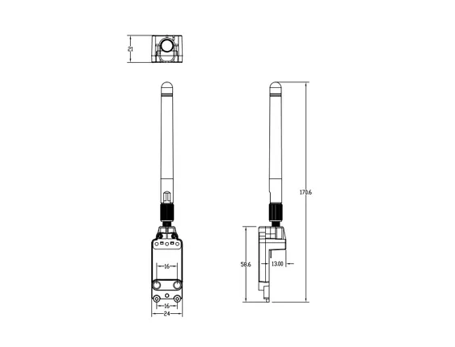

# Hat CBack NBIoT

**M5Stack** · Source collection

Revision: Unverified source identity

Coverage: Source collection; review pending

[Browse all manufacturers](../../../../BROWSE.md) · [Devices & IoT](../../../../DEVICES.md) · [Open in the browser guide](https://valleytech-black-wire-guide.pages.dev/?board=source-board-3555cd753818111656)

## Datasheets and original documentation

Board datasheet: **not yet recorded**. Visual reference: **available**.

[Manufacturer source (recorded link)](https://docs.m5stack.com/en/hat/C-BACK%20NB-IoT(SIM7020G))

A chip datasheet, schematic and board datasheet have different scopes. Match the exact hardware revision.

[Documentation coverage and remaining gaps](../../../../DOCUMENTATION.md)

## Dimensions

**source reference** · Unreviewed source · PNG

[Open original reference](../../../../library/media/2b873eb4767291a6c635b05cf21120cfd552c1a2918c0de4a01738b08a4f5c66.png)

**Credit and rights:** Source rights not yet established. Source/manufacturer: M5Stack.

[Source 1](https://static-cdn.m5stack.com/resource/docs/products/hat/C-BACK NB-IoT(SIM7020G)/img-20f9a259-f589-412b-9c8a-5130785ee673.png) · [Source 2](https://docs.m5stack.com/en/hat/C-BACK%20NB-IoT(SIM7020G))

Original source index: Dimensions. This file is searchable but has not been promoted to a reviewed physical board pinout.

Image revision: Not identified

SHA-256: `2b873eb4767291a6c635b05cf21120cfd552c1a2918c0de4a01738b08a4f5c66`

Pin assignments have not been independently electrically verified. Check board revision before wiring.
