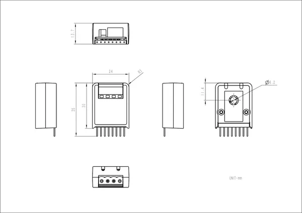

# Hat DAC2

**M5Stack** · Source collection

Revision: Unverified source identity  
Coverage: Source collection; review pending

[Browse all manufacturers](../../../../BROWSE.md) · [Desktop app](https://github.com/valleytechsolutions/black-wire-desktop)

## Dimensions

**source reference** · Unreviewed source · JPG

[Open original reference](../../../../library/media/9e9c52f9b9dd0b1f63302da0dd7b8f4f15a488a25b42d3ec9e4d6b413d370e12.jpg)

**Credit and rights:** Source rights not yet established. Source/manufacturer: M5Stack.

[Source 1](https://static-cdn.m5stack.com/resource/docs/products/hat/Hat-DAC2/img-6af530a5-400b-41b9-8ade-f3d275fdc03a.jpg) · [Source 2](https://docs.m5stack.com/en/hat/Hat-DAC2)

Original source index: Dimensions. This file is searchable but has not been promoted to a reviewed physical board pinout.

SHA-256: `9e9c52f9b9dd0b1f63302da0dd7b8f4f15a488a25b42d3ec9e4d6b413d370e12`

Pin assignments have not been independently electrically verified. Check board revision before wiring.
