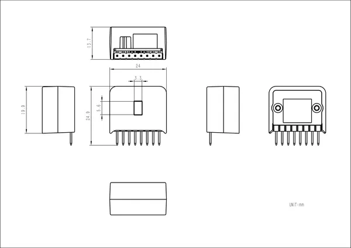

# Hat DLight

**M5Stack** · Source collection

Revision: Unverified source identity  
Coverage: Source collection; review pending

[Browse all manufacturers](../../../../BROWSE.md) · [Desktop app](https://github.com/valleytechsolutions/black-wire-desktop)

## Dimensions

**source reference** · Unreviewed source · PNG

[Open original reference](../../../../library/media/6a5612f9c488263ec937400de9b89a098c8f0e4d8930f88900699e9a72c5d903.png)

**Credit and rights:** Source rights not yet established. Source/manufacturer: M5Stack.

[Source 1](https://m5stack-doc.oss-cn-shenzhen.aliyuncs.com/852/U118_model_size_page_01.png) · [Source 2](https://docs.m5stack.com/en/hat/hat_dlight)

Original source index: Dimensions. This file is searchable but has not been promoted to a reviewed physical board pinout.

SHA-256: `6a5612f9c488263ec937400de9b89a098c8f0e4d8930f88900699e9a72c5d903`

Pin assignments have not been independently electrically verified. Check board revision before wiring.
