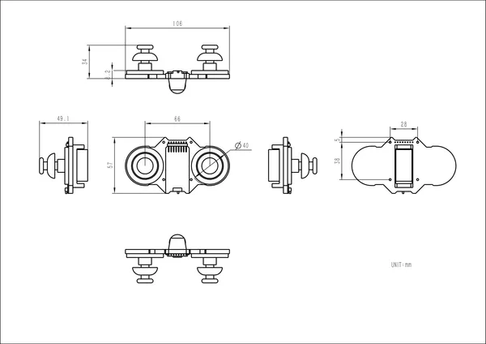

# Hat JoyC

**M5Stack** · Source collection

Revision: Unverified source identity  
Coverage: Source collection; review pending

[Browse all manufacturers](../../../../BROWSE.md) · [Desktop app](https://github.com/valleytechsolutions/black-wire-desktop)

## Dimensions

**source reference** · Unreviewed source · PNG

[Open original reference](../../../../library/media/1f8f9277fe5ba2e28f6a629ecfffd006b56035ef51b113f8d8c284f78f72b7b6.png)

**Credit and rights:** Source rights not yet established. Source/manufacturer: M5Stack.

[Source 1](https://m5stack-doc.oss-cn-shenzhen.aliyuncs.com/877/hatjoyc_U079.jpg) · [Source 2](https://docs.m5stack.com/en/hat/hat-joyc)

Original source index: Dimensions. This file is searchable but has not been promoted to a reviewed physical board pinout.

SHA-256: `1f8f9277fe5ba2e28f6a629ecfffd006b56035ef51b113f8d8c284f78f72b7b6`

Pin assignments have not been independently electrically verified. Check board revision before wiring.
