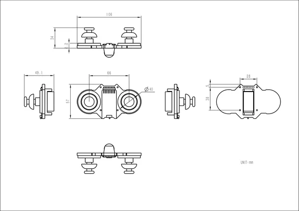

# Hat JoyC

**M5Stack** · Source collection

Revision: Unverified source identity

Coverage: Source collection; review pending

[Browse all manufacturers](../../../../BROWSE.md) · [Devices & IoT](../../../../DEVICES.md) · [Open in the browser guide](https://valleytech-black-wire-guide.pages.dev/?board=source-board-d2d3f4c368230182e4)

## Datasheets and original documentation

Board datasheet: **not yet recorded**. Visual reference: **available**.

[Manufacturer source (recorded link)](https://docs.m5stack.com/en/hat/hat-joyc)

A chip datasheet, schematic and board datasheet have different scopes. Match the exact hardware revision.

[Documentation coverage and remaining gaps](../../../../DOCUMENTATION.md)

## Dimensions

**source reference** · Unreviewed source · PNG

[Open original reference](../../../../library/media/1f8f9277fe5ba2e28f6a629ecfffd006b56035ef51b113f8d8c284f78f72b7b6.png)

**Credit and rights:** Source rights not yet established. Source/manufacturer: M5Stack.

[Source 1](https://m5stack-doc.oss-cn-shenzhen.aliyuncs.com/877/hatjoyc_U079.jpg) · [Source 2](https://docs.m5stack.com/en/hat/hat-joyc)

Original source index: Dimensions. This file is searchable but has not been promoted to a reviewed physical board pinout.

Image revision: Not identified

SHA-256: `1f8f9277fe5ba2e28f6a629ecfffd006b56035ef51b113f8d8c284f78f72b7b6`

Pin assignments have not been independently electrically verified. Check board revision before wiring.
