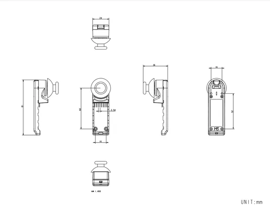

# Hat Mini JoyC

**M5Stack** · Source collection

Revision: Unverified source identity  
Coverage: Source collection; review pending

[Browse all manufacturers](../../../../BROWSE.md) · [Desktop app](https://github.com/valleytechsolutions/black-wire-desktop)

## Dimensions

**source reference** · Unreviewed source · PNG

[Open original reference](../../../../library/media/e682a9b5fc1cf40a48d0fa9e726e65c08efe594a0f8ef8cec557c26adb84da67.png)

**Credit and rights:** Source rights not yet established. Source/manufacturer: M5Stack.

[Source 1](https://static-cdn.m5stack.com/resource/docs/products/hat/MiniJoyC/img-14cbb54f-a375-4e6d-b73f-0d6bf0f53130.png) · [Source 2](https://docs.m5stack.com/en/hat/MiniJoyC)

Original source index: Dimensions. This file is searchable but has not been promoted to a reviewed physical board pinout.

SHA-256: `e682a9b5fc1cf40a48d0fa9e726e65c08efe594a0f8ef8cec557c26adb84da67`

Pin assignments have not been independently electrically verified. Check board revision before wiring.
