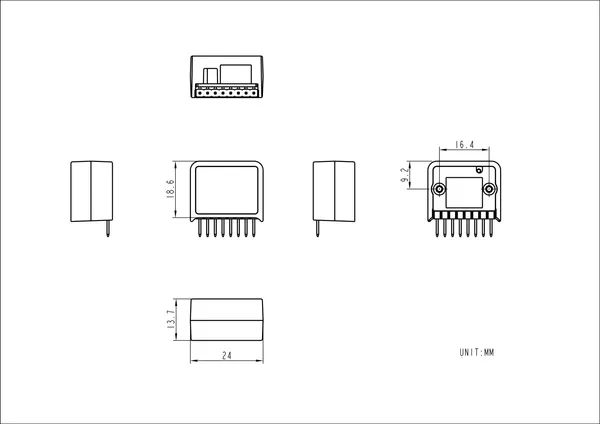

# Hat Vibrator

**M5Stack** · Source collection

Revision: Unverified source identity  
Coverage: Source collection; review pending

[Browse all manufacturers](../../../../BROWSE.md) · [Desktop app](https://github.com/valleytechsolutions/black-wire-desktop)

## Dimensions

**source reference** · Unreviewed source · PNG

[Open original reference](../../../../library/media/c4f8b1d94bf9f528c4e1815bf76bbbf8b466d88d7687408e6e86adbd629677e2.png)

**Credit and rights:** Source rights not yet established. Source/manufacturer: M5Stack.

[Source 1](https://static-cdn.m5stack.com/resource/docs/products/hat/HAT-Vibrator/img-f907f409-6f6f-48ec-837d-bd0728b14c52.png) · [Source 2](https://docs.m5stack.com/en/hat/HAT-Vibrator)

Original source index: Dimensions. This file is searchable but has not been promoted to a reviewed physical board pinout.

SHA-256: `c4f8b1d94bf9f528c4e1815bf76bbbf8b466d88d7687408e6e86adbd629677e2`

Pin assignments have not been independently electrically verified. Check board revision before wiring.
