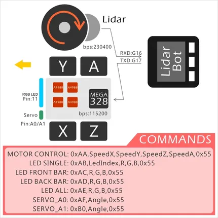

# LidarBot

**M5Stack** · Source collection

Revision: Unverified source identity  
Coverage: Source collection; review pending

[Browse all manufacturers](../../../../BROWSE.md) · [Desktop app](https://github.com/valleytechsolutions/black-wire-desktop)

## Block Diagram

**source reference** · Unreviewed source · PNG

[Open original reference](../../../../library/media/244872f21f00c22bf5863273ae5a915eefbc0bc9d6e643182fa42ab25d8ef5a6.png)

**Credit and rights:** Source rights not yet established. Source/manufacturer: M5Stack.

[Source 1](https://static-cdn.m5stack.com/resource/docs/products/app/lidarbot/lidarbot_07.webp) · [Source 2](https://docs.m5stack.com/en/app/lidarbot)

Original source index: Block Diagram. This file is searchable but has not been promoted to a reviewed physical board pinout.

SHA-256: `244872f21f00c22bf5863273ae5a915eefbc0bc9d6e643182fa42ab25d8ef5a6`

Pin assignments have not been independently electrically verified. Check board revision before wiring.
