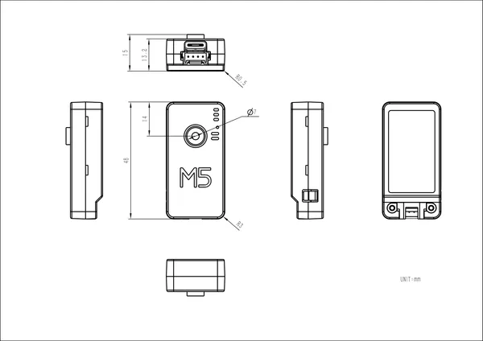

# M5Camera-X

**M5Stack** · Source collection

Revision: Unverified source identity  
Coverage: Source collection; review pending

[Browse all manufacturers](../../../../BROWSE.md) · [Desktop app](https://github.com/valleytechsolutions/black-wire-desktop)

## Dimensions

**source reference** · Unreviewed source · PNG

[Open original reference](../../../../library/media/2e2cc5fac8b28358a2b0fcf7dc0a9059c873dfe5a481df8a642f3f9e0a6ac308.png)

**Credit and rights:** Source rights not yet established. Source/manufacturer: M5Stack.

[Source 1](https://m5stack-doc.oss-cn-shenzhen.aliyuncs.com/1040/U082_X_TimerCamera_X_page_01.png) · [Source 2](https://docs.m5stack.com/en/unit/m5camera_x)

Original source index: Dimensions. This file is searchable but has not been promoted to a reviewed physical board pinout.

SHA-256: `2e2cc5fac8b28358a2b0fcf7dc0a9059c873dfe5a481df8a642f3f9e0a6ac308`

Pin assignments have not been independently electrically verified. Check board revision before wiring.
