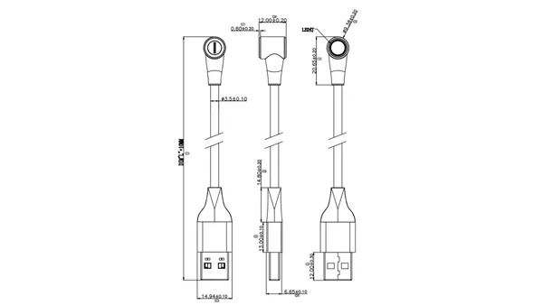

# Magnetic Type-C Cable

**M5Stack** · Source collection

Revision: Unverified source identity  
Coverage: Source collection; review pending

[Browse all manufacturers](../../../../BROWSE.md) · [Desktop app](https://github.com/valleytechsolutions/black-wire-desktop)

## Dimensions

**source reference** · Unreviewed source · PNG

[Open original reference](../../../../library/media/d329b2b07bc1c10952718e4b51db5ce6e104b3cd46ce5374b2ee9a2288a0e3dc.png)

**Credit and rights:** Source rights not yet established. Source/manufacturer: M5Stack.

[Source 1](https://static-cdn.m5stack.com/resource/docs/products/accessory/M5 Magnetic Type-C Cable/img-33c9a8c4-18d0-4968-912c-7edd6e79a341.png) · [Source 2](https://docs.m5stack.com/en/accessory/M5%20Magnetic%20Type-C%20Cable)

Original source index: Dimensions. This file is searchable but has not been promoted to a reviewed physical board pinout.

SHA-256: `d329b2b07bc1c10952718e4b51db5ce6e104b3cd46ce5374b2ee9a2288a0e3dc`

Pin assignments have not been independently electrically verified. Check board revision before wiring.
