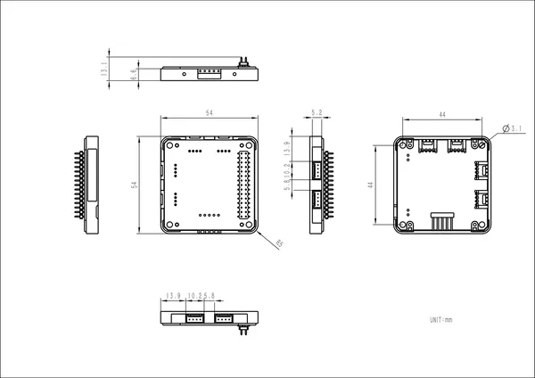

# Module ExtPort For Core2

**M5Stack** · Source collection

Revision: Unverified source identity  
Coverage: Source collection; review pending

[Browse all manufacturers](../../../../BROWSE.md) · [Desktop app](https://github.com/valleytechsolutions/black-wire-desktop)

## Dimensions

**source reference** · Unreviewed source · PNG

[Open original reference](../../../../library/media/2000b89ef22490cd65ad9d50a87c9c6b36b78c7f25b741aefa63c48d986cb38d.png)

**Credit and rights:** Source rights not yet established. Source/manufacturer: M5Stack.

[Source 1](https://m5stack-doc.oss-cn-shenzhen.aliyuncs.com/976/extportforcore2_page_01.png) · [Source 2](https://docs.m5stack.com/en/module/extport_for_core2)

Original source index: Dimensions. This file is searchable but has not been promoted to a reviewed physical board pinout.

SHA-256: `2000b89ef22490cd65ad9d50a87c9c6b36b78c7f25b741aefa63c48d986cb38d`

## Pinout

**source reference** · Unreviewed source · PNG

[Open original reference](../../../../library/media/8280de26a1e2e8f2dbb2bb43dee45a3dc5d2f80d6c122a5ca6fa71fe15121385.png)

**Credit and rights:** Source rights not yet established. Source/manufacturer: M5Stack.

[Source 1](https://static-cdn.m5stack.com/resource/docs/products/module/extport_for_core2/extport_for_core2_grove_01.webp) · [Source 2](https://docs.m5stack.com/en/module/extport_for_core2)

Original source index: Pinout. This file is searchable but has not been promoted to a reviewed physical board pinout.

SHA-256: `8280de26a1e2e8f2dbb2bb43dee45a3dc5d2f80d6c122a5ca6fa71fe15121385`

Pin assignments have not been independently electrically verified. Check board revision before wiring.
