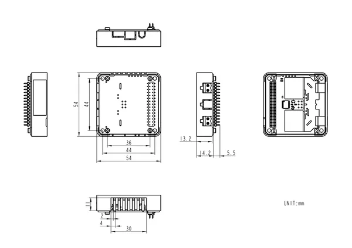

# Module13.2 2Relay

**M5Stack** · Source collection

Revision: Unverified source identity

Coverage: Source collection; review pending

[Browse all manufacturers](../../../../BROWSE.md) · [Devices & IoT](../../../../DEVICES.md) · [Open in the browser guide](https://valleytech-black-wire-guide.pages.dev/?board=source-board-ca5ac5069f3672db8c)

## Datasheets and original documentation

Board datasheet: **not yet recorded**. Visual reference: **available**.

[Manufacturer source (recorded link)](https://docs.m5stack.com/en/module/2Relay)

A chip datasheet, schematic and board datasheet have different scopes. Match the exact hardware revision.

[Documentation coverage and remaining gaps](../../../../DOCUMENTATION.md)

## Dimensions

**source reference** · Unreviewed source · PNG

[Open original reference](../../../../library/media/9c1f9da63cd75d390cc834ff384f8d7125bf6dce52c8309a723a96abafaaff87.png)

**Credit and rights:** Source rights not yet established. Source/manufacturer: M5Stack.

[Source 1](https://static-cdn.m5stack.com/resource/docs/products/module/2Relay/img-f508ceef-20b6-4400-a00c-3d452707197a.png) · [Source 2](https://docs.m5stack.com/en/module/2Relay)

Original source index: Dimensions. This file is searchable but has not been promoted to a reviewed physical board pinout.

Image revision: Not identified

SHA-256: `9c1f9da63cd75d390cc834ff384f8d7125bf6dce52c8309a723a96abafaaff87`

Pin assignments have not been independently electrically verified. Check board revision before wiring.
