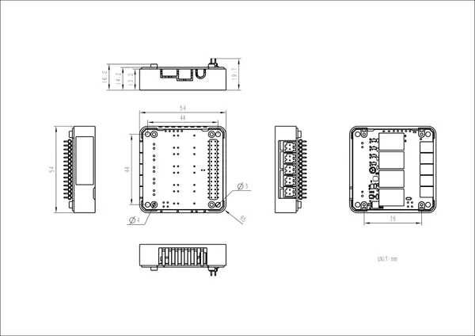

# Module13.2 4Relay v1.1

**M5Stack** · Source collection

Revision: Unverified source identity  
Coverage: Source collection; review pending

[Browse all manufacturers](../../../../BROWSE.md) · [Desktop app](https://github.com/valleytechsolutions/black-wire-desktop)

## Dimensions

**source reference** · Unreviewed source · JPG

[Open original reference](../../../../library/media/85d6d0d055d6141a2a6dcdf5923899e398e0f01155ff6e1f48508ad10543bfd6.jpg)

**Credit and rights:** Source rights not yet established. Source/manufacturer: M5Stack.

[Source 1](https://static-cdn.m5stack.com/resource/docs/products/module/4Relay Module 13.2_V1.1/img-d370e126-9eef-432f-a08b-de8ae6a6222a.jpg) · [Source 2](https://docs.m5stack.com/en/module/4Relay%20Module%2013.2_V1.1)

Original source index: Dimensions. This file is searchable but has not been promoted to a reviewed physical board pinout.

SHA-256: `85d6d0d055d6141a2a6dcdf5923899e398e0f01155ff6e1f48508ad10543bfd6`

Pin assignments have not been independently electrically verified. Check board revision before wiring.
