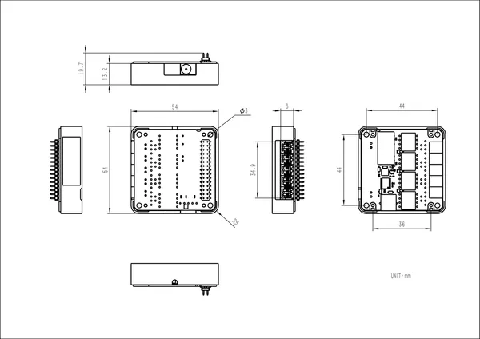

# Module13.2 AIN4-20mA

**M5Stack** · Source collection

Revision: Unverified source identity  
Coverage: Source collection; review pending

[Browse all manufacturers](../../../../BROWSE.md) · [Desktop app](https://github.com/valleytechsolutions/black-wire-desktop)

## Dimensions

**source reference** · Unreviewed source · PNG

[Open original reference](../../../../library/media/e78240b8b0a4c53fcf049847ec27f180039efda2233f7b8bf8c39ce4d89edf0e.png)

**Credit and rights:** Source rights not yet established. Source/manufacturer: M5Stack.

[Source 1](https://m5stack-doc.oss-cn-shenzhen.aliyuncs.com/1029/M133-al4-20ma_page_01.png) · [Source 2](https://docs.m5stack.com/en/module/AIN4-20mA%20Module%2013.2)

Original source index: Dimensions. This file is searchable but has not been promoted to a reviewed physical board pinout.

SHA-256: `e78240b8b0a4c53fcf049847ec27f180039efda2233f7b8bf8c39ce4d89edf0e`

Pin assignments have not been independently electrically verified. Check board revision before wiring.
