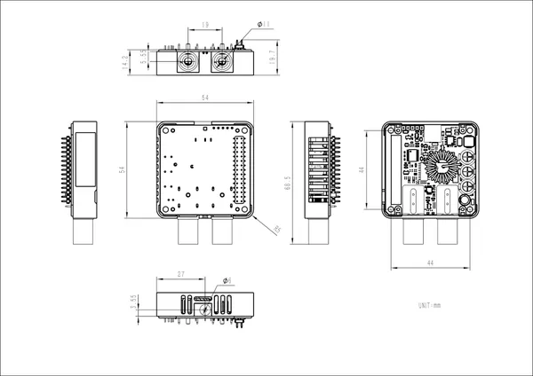

# Module13.2 PPS

**M5Stack** · Source collection

Revision: Unverified source identity  
Coverage: Source collection; review pending

[Browse all manufacturers](../../../../BROWSE.md) · [Desktop app](https://github.com/valleytechsolutions/black-wire-desktop)

## Dimensions

**source reference** · Unreviewed source · JPG

[Open original reference](../../../../library/media/e92ac03efc20b6e510ab71d11bcf102681a185c850b286d9ef1c82153c2b8561.jpg)

**Credit and rights:** Source rights not yet established. Source/manufacturer: M5Stack.

[Source 1](https://static-cdn.m5stack.com/resource/docs/products/module/Module13.2-PPS/img-44fd167e-cfab-4a22-8ad4-675ee9cbf907.jpg) · [Source 2](https://docs.m5stack.com/en/module/Module13.2-PPS)

Original source index: Dimensions. This file is searchable but has not been promoted to a reviewed physical board pinout.

SHA-256: `e92ac03efc20b6e510ab71d11bcf102681a185c850b286d9ef1c82153c2b8561`

Pin assignments have not been independently electrically verified. Check board revision before wiring.
