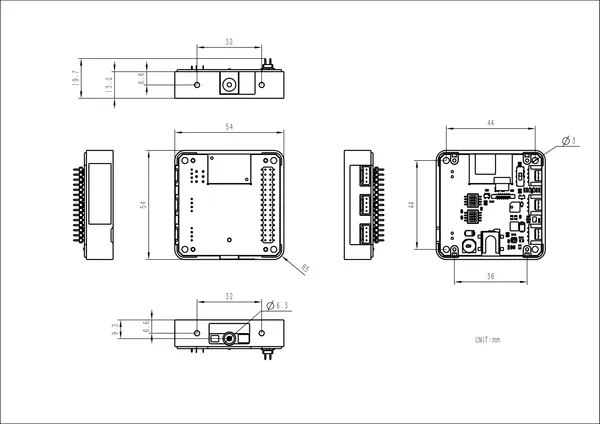

# Module13.2 QRCode

**M5Stack** · Source collection

Revision: Unverified source identity  
Coverage: Source collection; review pending

[Browse all manufacturers](../../../../BROWSE.md) · [Desktop app](https://github.com/valleytechsolutions/black-wire-desktop)

## Dimensions

**source reference** · Unreviewed source · PNG

[Open original reference](../../../../library/media/bd4eb010f45b341a588af717177d44c79ed2ec61edca0ab73c6539e04a249020.png)

**Credit and rights:** Source rights not yet established. Source/manufacturer: M5Stack.

[Source 1](https://m5stack-doc.oss-cn-shenzhen.aliyuncs.com/1163/qrcoder-module_page_01.png) · [Source 2](https://docs.m5stack.com/en/module/Module13.2_QRCode)

Original source index: Dimensions. This file is searchable but has not been promoted to a reviewed physical board pinout.

SHA-256: `bd4eb010f45b341a588af717177d44c79ed2ec61edca0ab73c6539e04a249020`

Pin assignments have not been independently electrically verified. Check board revision before wiring.
