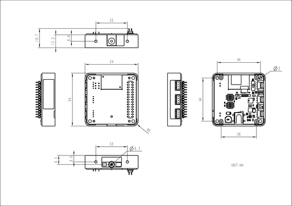

# Module13.2 QRCode

**M5Stack** · Source collection

Revision: Unverified source identity

Coverage: Source collection; review pending

[Browse all manufacturers](../../../../BROWSE.md) · [Devices & IoT](../../../../DEVICES.md) · [Open in the browser guide](https://valleytech-black-wire-guide.pages.dev/?board=source-board-b9e9cca64dddf0e6aa)

## Datasheets and original documentation

Board datasheet: **not yet recorded**. Visual reference: **available**.

[Manufacturer source (recorded link)](https://docs.m5stack.com/en/module/Module13.2_QRCode)

A chip datasheet, schematic and board datasheet have different scopes. Match the exact hardware revision.

[Documentation coverage and remaining gaps](../../../../DOCUMENTATION.md)

## Dimensions

**source reference** · Unreviewed source · PNG

[Open original reference](../../../../library/media/bd4eb010f45b341a588af717177d44c79ed2ec61edca0ab73c6539e04a249020.png)

**Credit and rights:** Source rights not yet established. Source/manufacturer: M5Stack.

[Source 1](https://m5stack-doc.oss-cn-shenzhen.aliyuncs.com/1163/qrcoder-module_page_01.png) · [Source 2](https://docs.m5stack.com/en/module/Module13.2_QRCode)

Original source index: Dimensions. This file is searchable but has not been promoted to a reviewed physical board pinout.

Image revision: Not identified

SHA-256: `bd4eb010f45b341a588af717177d44c79ed2ec61edca0ab73c6539e04a249020`

Pin assignments have not been independently electrically verified. Check board revision before wiring.
