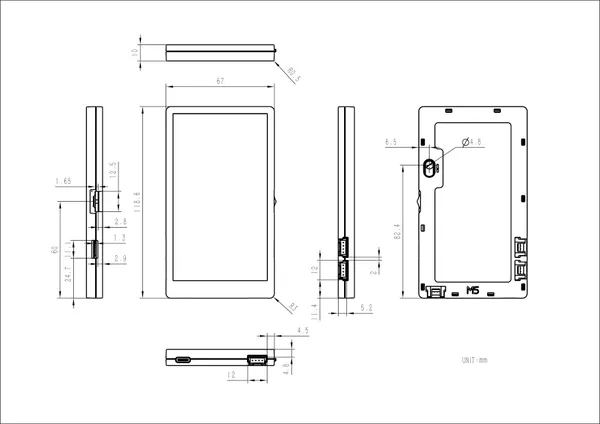

# Paper

**M5Stack** · Source collection

Revision: Unverified source identity  
Coverage: Source collection; review pending

[Browse all manufacturers](../../../../BROWSE.md) · [Devices & IoT](../../../../DEVICES.md) · [Open in the browser guide](https://valleytech-black-wire-guide.pages.dev/?board=source-board-5654dd9b9e82931965)

Device category: **Controllers & instruments**

## Dimensions

**source reference** · Unreviewed source · JPG

[Open original reference](../../../../library/media/4fcf1c96b32a7e67d6f690fc04d8a21cc2ae75fa001e0ae01623b0a05eb23864.jpg)

**Credit and rights:** Source rights not yet established. Source/manufacturer: M5Stack.

[Source 1](https://m5stack.oss-cn-shenzhen.aliyuncs.com/resource/docs/products/core/m5paper/module%20size.jpg) · [Source 2](https://docs.m5stack.com/en/core/m5paper)

Original source index: Dimensions. This file is searchable but has not been promoted to a reviewed physical board pinout.

Image revision: Not identified

SHA-256: `4fcf1c96b32a7e67d6f690fc04d8a21cc2ae75fa001e0ae01623b0a05eb23864`

Pin assignments have not been independently electrically verified. Check board revision before wiring.
