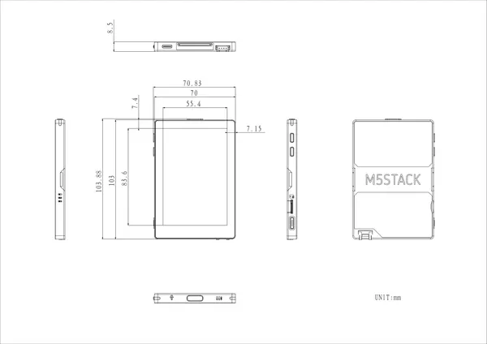

# PaperColor

**M5Stack** · Source collection

Revision: Unverified source identity  
Coverage: Source collection; review pending

[Browse all manufacturers](../../../../BROWSE.md) · [Devices & IoT](../../../../DEVICES.md) · [Open in the browser guide](https://valleytech-black-wire-guide.pages.dev/?board=source-board-dcfd0558f06c475600)

Device category: **Controllers & instruments**

## Dimensions

**source reference** · Unreviewed source · PNG

[Open original reference](../../../../library/media/1d69d160b9a7d6467c13855709e453f5c9bd4b0f0ccdb59e79c2f16a0b6add23.png)

**Credit and rights:** Source rights not yet established. Source/manufacturer: M5Stack.

[Source 1](https://m5stack-doc.oss-cn-shenzhen.aliyuncs.com/1239/C151PaperColor_model_size_page_01.png) · [Source 2](https://docs.m5stack.com/en/core/PaperColor)

Original source index: Dimensions. This file is searchable but has not been promoted to a reviewed physical board pinout.

Image revision: Not identified

SHA-256: `1d69d160b9a7d6467c13855709e453f5c9bd4b0f0ccdb59e79c2f16a0b6add23`

Pin assignments have not been independently electrically verified. Check board revision before wiring.
