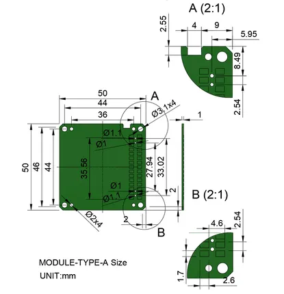

# Proto Board

**M5Stack** · Source collection

Revision: Unverified source identity  
Coverage: Source collection; review pending

[Browse all manufacturers](../../../../BROWSE.md) · [Desktop app](https://github.com/valleytechsolutions/black-wire-desktop)

## Dimensions

**source reference** · Unreviewed source · JPG

[Open original reference](../../../../library/media/a03b6da2d9fb0d10593b8809d13f7b5dd2af2ce3ccc6ad928f300bc3a94b7614.jpg)

**Credit and rights:** Source rights not yet established. Source/manufacturer: M5Stack.

[Source 1](https://m5stack-doc.oss-cn-shenzhen.aliyuncs.com/1196/A002_model-size-Module-Type-A.jpg) · [Source 2](https://docs.m5stack.com/en/accessory/proto_board)

Original source index: Dimensions. This file is searchable but has not been promoted to a reviewed physical board pinout.

SHA-256: `a03b6da2d9fb0d10593b8809d13f7b5dd2af2ce3ccc6ad928f300bc3a94b7614`

Pin assignments have not been independently electrically verified. Check board revision before wiring.
