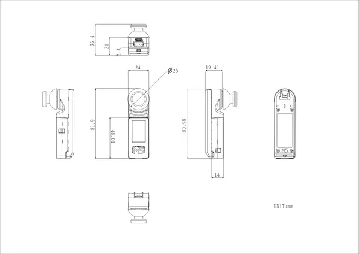
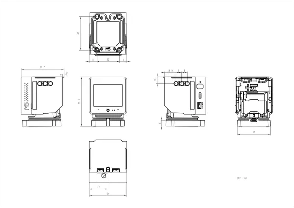

# StackChan

**M5Stack** · Source collection

Revision: Unverified source identity  
Coverage: Source collection; review pending

[Browse all manufacturers](../../../../BROWSE.md) · [Desktop app](https://github.com/valleytechsolutions/black-wire-desktop)

## Dimensions

**source reference** · Unreviewed source · PNG

[Open original reference](../../../../library/media/77c3f5a3f9c88310972051aa311fa71f7965c0f0fbc3c835ea209afb63199e4f.png)

**Credit and rights:** Source rights not yet established. Source/manufacturer: M5Stack.

[Source 1](https://m5stack-doc.oss-cn-shenzhen.aliyuncs.com/1205/u156hatminijoyc_page_01.png) · [Source 2](https://docs.m5stack.com/en/StackChan)

Original source index: Dimensions. This file is searchable but has not been promoted to a reviewed physical board pinout.

SHA-256: `77c3f5a3f9c88310972051aa311fa71f7965c0f0fbc3c835ea209afb63199e4f`

## Dimensions

**source reference** · Unreviewed source · PNG

[Open original reference](../../../../library/media/f28f607625cc17db8a50dba523369a9ab2142b964395c62c8f3ac5d4a934ee21.png)

**Credit and rights:** Source rights not yet established. Source/manufacturer: M5Stack.

[Source 1](https://m5stack-doc.oss-cn-shenzhen.aliyuncs.com/1205/Model_Size.png) · [Source 2](https://docs.m5stack.com/en/StackChan)

Original source index: Dimensions. This file is searchable but has not been promoted to a reviewed physical board pinout.

SHA-256: `f28f607625cc17db8a50dba523369a9ab2142b964395c62c8f3ac5d4a934ee21`

Pin assignments have not been independently electrically verified. Check board revision before wiring.
