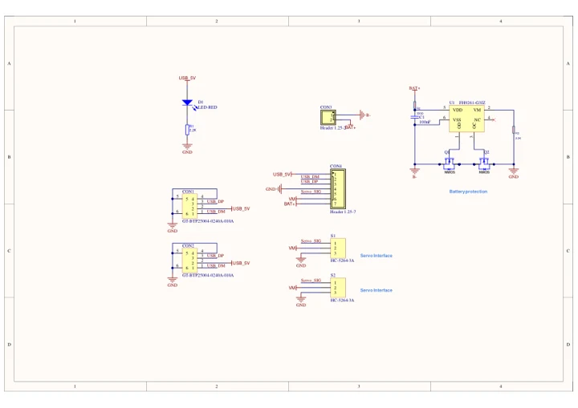
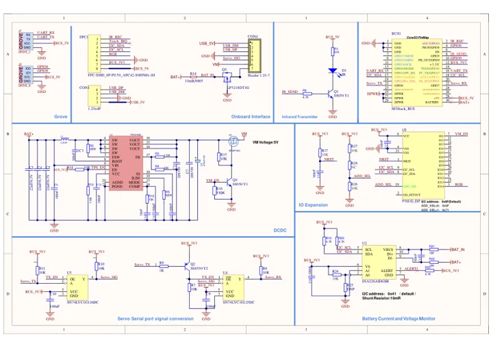
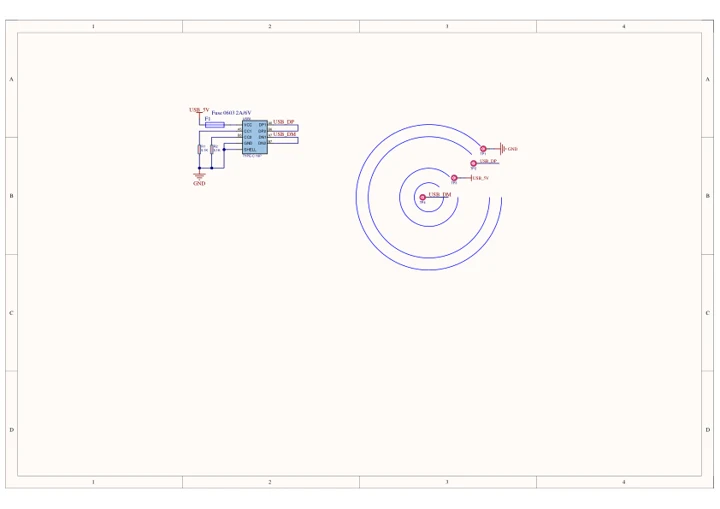
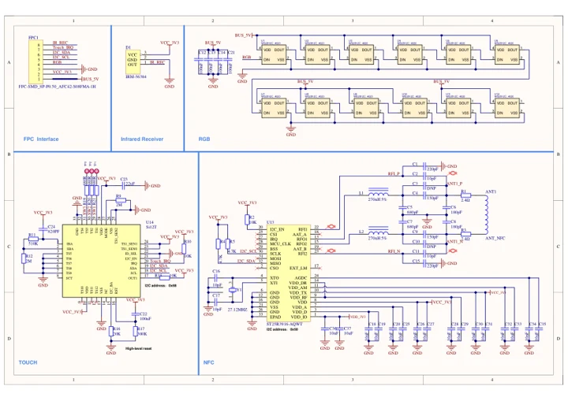

# StackChan Body

**M5Stack** · Source collection

Revision: Unverified source identity

Coverage: Manufacturer references reviewed by scope; independent electrical and all-connector review pending

[Browse all manufacturers](../../../../BROWSE.md) · [Devices & IoT](../../../../DEVICES.md) · [Open in the browser guide](https://valleytech-black-wire-guide.pages.dev/?board=source-board-5ecba9322a25331bc8)

## Datasheets and original documentation

Board datasheet: **not yet recorded**. Visual reference: **available**.

[Manufacturer hardware documentation](https://docs.m5stack.com/en/base/StackChan_Body)

- **schematic / recorded-source**: [StackChan Base Adapter Board Schematic PDF](https://m5stack-doc.oss-cn-shenzhen.aliyuncs.com/1205/SCH_Adapter.pdf) · [saved document](../../../../library/media/8d0b419244dd0ef18ca371742a5f63b5ab9b55712cd97d6a459fad7b27e7dbbb.pdf)
- **schematic / recorded-source**: [StackChan Base Power Board Schematic PDF](https://m5stack-doc.oss-cn-shenzhen.aliyuncs.com/1205/SCH_Power.pdf) · [saved document](../../../../library/media/cbffdb4b2baee62a13e221b43398f2cbe7f1cd16719aba9782026a902b7dd265.pdf)
- **schematic / recorded-source**: [StackChan Base Ring Board Schematic PDF](https://m5stack-doc.oss-cn-shenzhen.aliyuncs.com/1205/SCH_Ring.pdf) · [saved document](../../../../library/media/ff0d6ba39502fdbed437828f1b1aedd5e371dd2ea16054d8c7cd114dddc6a10c.pdf)
- **schematic / recorded-source**: [StackChan Base Touch Board Schematic PDF](https://m5stack-doc.oss-cn-shenzhen.aliyuncs.com/1205/SCH_Touch.pdf) · [saved document](../../../../library/media/75ec0ca5af5c4f03d7abe6a0c7835c9d0ba3a323eb0b723bdf6aeab5a3c2ac1c.pdf)
- **hardware-guide / board**: [Manufacturer pin and hardware documentation](https://docs.m5stack.com/en/base/StackChan_Body) · online

A chip datasheet, schematic and board datasheet have different scopes. Match the exact hardware revision.

[Documentation coverage and remaining gaps](../../../../DOCUMENTATION.md)

## Dimensions

**source reference** · Unreviewed source · PNG

[Open original reference](../../../../library/media/8a0523eb93ac54b244faca289f748a5ed7bf533a68fbb1de486031a89d279187.png)

**Credit and rights:** Source rights not yet established. Source/manufacturer: M5Stack.

[Source 1](https://m5stack-doc.oss-cn-shenzhen.aliyuncs.com/1255/A180_StackChanBody_model_size_page_01.png) · [Source 2](https://docs.m5stack.com/en/base/StackChan_Body)

Original source index: Dimensions. This file is searchable but has not been promoted to a reviewed physical board pinout.

Image revision: Not identified

SHA-256: `8a0523eb93ac54b244faca289f748a5ed7bf533a68fbb1de486031a89d279187`

## StackChan Base Adapter Board Schematic PDF

**original reference PDF** · Manufacturer source and first-page preview inspected; electrical correctness and all-connector completeness not independently approved. · PDF

[Open original reference](../../../../library/media/8d0b419244dd0ef18ca371742a5f63b5ab9b55712cd97d6a459fad7b27e7dbbb.pdf)

**Credit and rights:** Manufacturer artwork; reuse and print rights not established. Inclusion does not relicense the original.. Source/manufacturer: M5Stack.

[Source 1](https://m5stack-doc.oss-cn-shenzhen.aliyuncs.com/1205/SCH_Adapter.pdf) · [Source 2](https://docs.m5stack.com/en/base/StackChan_Body)

Manufacturer source retained unchanged. Manufacturer source and first-page preview inspected; electrical correctness and all-connector completeness not independently approved.

Image revision: As supplied in the original; match exact board revision

SHA-256: `8d0b419244dd0ef18ca371742a5f63b5ab9b55712cd97d6a459fad7b27e7dbbb`

## StackChan Base Power Board Schematic PDF

**original reference PDF** · Manufacturer source and first-page preview inspected; independent electrical and all-connector completeness review pending. · PDF

[Open original reference](../../../../library/media/cbffdb4b2baee62a13e221b43398f2cbe7f1cd16719aba9782026a902b7dd265.pdf)

**Credit and rights:** Manufacturer artwork; reuse and print rights not established. Inclusion does not relicense the original.. Source/manufacturer: M5Stack.

[Source 1](https://m5stack-doc.oss-cn-shenzhen.aliyuncs.com/1205/SCH_Power.pdf) · [Source 2](https://docs.m5stack.com/en/base/StackChan_Body)

Manufacturer source retained unchanged. Manufacturer source and first-page preview inspected; independent electrical and all-connector completeness review pending.

Image revision: As supplied in the original; match exact board revision

SHA-256: `cbffdb4b2baee62a13e221b43398f2cbe7f1cd16719aba9782026a902b7dd265`

## StackChan Base Ring Board Schematic PDF

**original reference PDF** · Manufacturer source and first-page preview inspected; electrical correctness and all-connector completeness not independently approved. · PDF

[Open original reference](../../../../library/media/ff0d6ba39502fdbed437828f1b1aedd5e371dd2ea16054d8c7cd114dddc6a10c.pdf)

**Credit and rights:** Manufacturer artwork; reuse and print rights not established. Inclusion does not relicense the original.. Source/manufacturer: M5Stack.

[Source 1](https://m5stack-doc.oss-cn-shenzhen.aliyuncs.com/1205/SCH_Ring.pdf) · [Source 2](https://docs.m5stack.com/en/base/StackChan_Body)

Manufacturer source retained unchanged. Manufacturer source and first-page preview inspected; electrical correctness and all-connector completeness not independently approved.

Image revision: As supplied in the original; match exact board revision

SHA-256: `ff0d6ba39502fdbed437828f1b1aedd5e371dd2ea16054d8c7cd114dddc6a10c`

## StackChan Base Touch Board Schematic PDF

**original reference PDF** · Manufacturer source and first-page preview inspected; electrical correctness and all-connector completeness not independently approved. · PDF

[Open original reference](../../../../library/media/75ec0ca5af5c4f03d7abe6a0c7835c9d0ba3a323eb0b723bdf6aeab5a3c2ac1c.pdf)

**Credit and rights:** Manufacturer artwork; reuse and print rights not established. Inclusion does not relicense the original.. Source/manufacturer: M5Stack.

[Source 1](https://m5stack-doc.oss-cn-shenzhen.aliyuncs.com/1205/SCH_Touch.pdf) · [Source 2](https://docs.m5stack.com/en/base/StackChan_Body)

Manufacturer source retained unchanged. Manufacturer source and first-page preview inspected; electrical correctness and all-connector completeness not independently approved.

Image revision: As supplied in the original; match exact board revision

SHA-256: `75ec0ca5af5c4f03d7abe6a0c7835c9d0ba3a323eb0b723bdf6aeab5a3c2ac1c`

Pin assignments have not been independently electrically verified. Check board revision before wiring.
