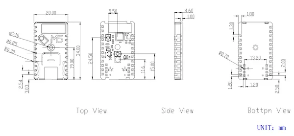

# Stamp-C3

**M5Stack** · Source collection

Revision: Unverified source identity  
Coverage: Source collection; review pending

[Browse all manufacturers](../../../../BROWSE.md) · [Desktop app](https://github.com/valleytechsolutions/black-wire-desktop)

## Dimensions

**source reference** · Unreviewed source · PNG

[Open original reference](../../../../library/media/5ee75080f2e996f2a3b1dc0676310c681df7a5a60a215cdcb76b3d1210434ef4.png)

**Credit and rights:** Source rights not yet established. Source/manufacturer: M5Stack.

[Source 1](https://static-cdn.m5stack.com/resource/docs/products/core/stamp_c3u/stamp_c3&c3u_size_01.webp) · [Source 2](https://docs.m5stack.com/en/core/stamp_c3)

Original source index: Dimensions. This file is searchable but has not been promoted to a reviewed physical board pinout.

SHA-256: `5ee75080f2e996f2a3b1dc0676310c681df7a5a60a215cdcb76b3d1210434ef4`

Pin assignments have not been independently electrically verified. Check board revision before wiring.
