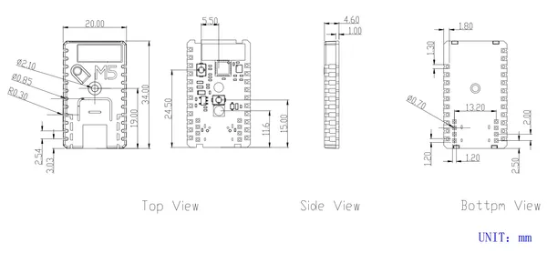

# Stamp-C3

**M5Stack** · Source collection

Revision: Unverified source identity

Coverage: Source collection; review pending

[Browse all manufacturers](../../../../BROWSE.md) · [Devices & IoT](../../../../DEVICES.md) · [Open in the browser guide](https://valleytech-black-wire-guide.pages.dev/?board=source-board-26502d3bfd4e3d490f)

## Datasheets and original documentation

Board datasheet: **not yet recorded**. Visual reference: **available**.

[Manufacturer source (recorded link)](https://docs.m5stack.com/en/core/stamp_c3)

A chip datasheet, schematic and board datasheet have different scopes. Match the exact hardware revision.

[Documentation coverage and remaining gaps](../../../../DOCUMENTATION.md)

## Dimensions

**source reference** · Unreviewed source · PNG

[Open original reference](../../../../library/media/5ee75080f2e996f2a3b1dc0676310c681df7a5a60a215cdcb76b3d1210434ef4.png)

**Credit and rights:** Source rights not yet established. Source/manufacturer: M5Stack.

[Source 1](https://static-cdn.m5stack.com/resource/docs/products/core/stamp_c3u/stamp_c3&c3u_size_01.webp) · [Source 2](https://docs.m5stack.com/en/core/stamp_c3)

Original source index: Dimensions. This file is searchable but has not been promoted to a reviewed physical board pinout.

Image revision: Not identified

SHA-256: `5ee75080f2e996f2a3b1dc0676310c681df7a5a60a215cdcb76b3d1210434ef4`

Pin assignments have not been independently electrically verified. Check board revision before wiring.
