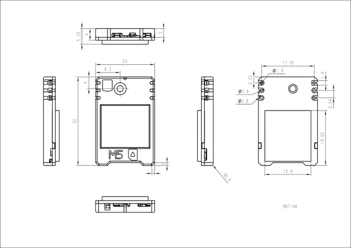

# Stamp Cat1

**M5Stack** · Source collection

Revision: Unverified source identity  
Coverage: Source collection; review pending

[Browse all manufacturers](../../../../BROWSE.md) · [Desktop app](https://github.com/valleytechsolutions/black-wire-desktop)

## Dimensions

**source reference** · Unreviewed source · JPG

[Open original reference](../../../../library/media/b5eae09f63c272e2e917b0e9b3c060069ecc3bab1fd20abfadd68a5f34553a11.jpg)

**Credit and rights:** Source rights not yet established. Source/manufacturer: M5Stack.

[Source 1](https://static-cdn.m5stack.com/resource/docs/products/stamp/stamp_cat1/stamp_com_size_01.webp) · [Source 2](https://docs.m5stack.com/en/stamp/stamp_cat1)

Original source index: Dimensions. This file is searchable but has not been promoted to a reviewed physical board pinout.

SHA-256: `b5eae09f63c272e2e917b0e9b3c060069ecc3bab1fd20abfadd68a5f34553a11`

Pin assignments have not been independently electrically verified. Check board revision before wiring.
